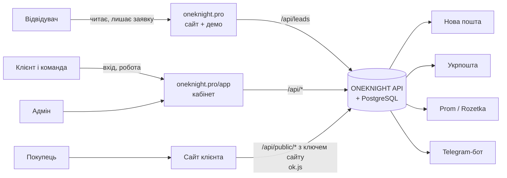
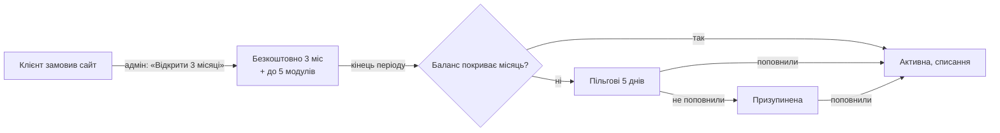

# ONEKNIGHT: архітектура проєкту

Карта проєкту: що є, для кого, де живе і як частини пов'язані. Технічні рішення по кроках (чому саме так) лежать у [docs/decisions.md](docs/decisions.md), API для сайтів клієнтів описано в [docs/public-api.md](docs/public-api.md), чого ще бракує від власника — у [TODO.md](TODO.md).

Стан на 29.09.2026: усе працює локально, домен `oneknight.pro` ще не підключений до сервера.

---

## 1. Три частини проєкту

| Частина | Адреса | Для кого | Навіщо |
| --- | --- | --- | --- |
| **Сайт ONEKNIGHT** | `oneknight.pro` (укр.), `oneknight.pro/en` | Відвідувачі, майбутні клієнти | Показати послуги, ціни, кейс, демо ONEKNIGHT і зібрати заявку |
| **Кабінет ONEKNIGHT** | `oneknight.pro/app` | Клієнти (власники бізнесу та їхня команда), адмін | Керувати сайтом, товарами, замовленнями, відгуками, аналітикою, доставкою, оплатою |
| **Сайти клієнтів** | домени клієнтів (наприклад `karpatu.shop`) | Покупці клієнтів | Продавати; товари, замовлення, відгуки, аналітика й вигляд беруться з ONEKNIGHT через публічний API |



---

## 2. Хто користується і що бачить

| Хто | Де працює | Що може |
| --- | --- | --- |
| **Відвідувач** | сайт | Читати, гратися з демо, залишити заявку (бриф) або написати в месенджер |
| **Власник бізнесу** (`owner`) | кабінет | Усе в своєму бізнесі: сайт, товари, замовлення, модулі, інтеграції, оплата, команда, резервні копії, назва бізнесу |
| **Менеджер** (`manager`) | кабінет | Те, що дав власник. За замовчуванням: замовлення, товари, відгуки, підтримка |
| **Маркетолог** (`marketer`) | кабінет | Те, що дав власник. За замовчуванням: аналітика, відгуки, сайт |
| **Покупець** | сайт клієнта | Купити, залишити відгук. Акаунта в ONEKNIGHT не має |
| **Адмін платформи** (Іван, `isAdmin`) | кабінет, режим «Адмінка» | Усі заявки, клієнти й сайти, відкриття пробного періоду, підтвердження поповнень, звернення в підтримку, ключі доступу й промокоди, посилання для зміни пароля |

Права задаються галочками в «Команді»: `orders`, `products`, `reviews`, `analytics`, `site`, `modules`, `billing`, `team`, `support`. Власник завжди має всі. Одна людина може бути в кількох бізнесах і перемикатися між ними вгорі кабінету. Сервер перевіряє права сам, інтерфейс лише ховає недоступне.

---

## 3. Сайт oneknight.pro

Одна довга сторінка, блоки по порядку:

| # | Блок | Для чого |
| --- | --- | --- |
| 1 | Hero (рідина WebGL) | Перше враження, кнопка «Замовити» |
| 2 | Хаос → система | Біль клієнта: розрізнені інструменти |
| 3 | Воронка | Як сайт перетворює відвідувачів на заявки |
| 4 | Послуги | 5 напрямів: сайти, автоматизація, аналітика, реклама, SEO/GEO/AI, з інтерактивом |
| 5 | Ціни | Типи сайтів від 7 000 / 12 000 / 14 000 / 15 000+ грн |
| 6 | Не шаблон | Порівняння шаблон vs система |
| 7 | Кейс Karpatu | Реальна робота |
| 8 | ONEKNIGHT: вступ | Що таке продукт |
| 9 | Демо ONEKNIGHT | Робоча демоверсія на вигаданих даних (позначено) |
| 10 | Модулі | Каталог модулів і ціни |
| 11 | Пропозиція | 3 місяці ONEKNIGHT безкоштовно й до 5 модулів із сайтом |
| 12 | Довіра | Чому можна довіряти (без вигаданих відгуків) |
| 13 | Процес | Етапи роботи |
| 14 | Підтримка | Що входить у підтримку |
| 15 | Про мене | Хто робить |
| 16 | Фінал | Останній заклик |

Також: юридичні сторінки `/legal/{privacy, terms, offer, cookies, oneknight-terms, subscription-terms, refund}`, сторінка 404, англійська версія `/en`.

**Куди веде заявка:** форма «Замовити» → `POST /api/leads` → заявка з номером у базі, сповіщення Івану в Telegram, видно в «Адміністрування → Заявки». Альтернатива: Telegram, Viber/WhatsApp, Facebook. Якщо людина вже увійшла, заявка прив'язується до її акаунта й бізнесу.

**Прокрутка:** звичайна, крім анімованих сцен (hero, хаос, «не шаблон», кейс, ONEKNIGHT, процес), де один жест доводить анімацію до наступного кадру.

---

## 4. Кабінет ONEKNIGHT (`/app`): логіка панелі

Погоджено з власником 29.09.2026 (135 питань, сирі відповіді — [docs/panel-answers.md](docs/panel-answers.md)). Принцип: у панелі лише те, що допомагає клієнту продавати, а тобі — продавати ONEKNIGHT. Що вже зроблено, а що ні, — у 4.12.

### 4.1. Каркас

- **Меню зліва, 4 групи:**
  - Робота: Головна · Замовлення · Покупці · Товари · Відгуки · Аналітика
  - Сайт: Сайт
  - Розвиток: Модулі · Послуги
  - Налаштування: Інтеграції · Оплата · Команда · Профіль і безпека

  Унизу: «Підтримка», «На сайт», «Вийти».
- **Верхня панель**:
  - перемикач бізнесу (якщо кілька) і перемикач сайту («Усі сайти» або один, видно при 2+ сайтах);
  - **глобальний пошук** (клавіша `/`) по замовленнях, покупцях, товарах, ТТН і телефону;
  - дзвіночок, користувач.
- **Телефон**: нижня панель Головна · Замовлення · Покупці · Товари · «Ще». Окремого застосунку (PWA) не робимо.
- **Тема**: як у системі + перемикач. **Мова**: українська + англійська.
- **Некуплений модуль**: пункт видно із замком. Усередині — що дає, ціна, «Підключити». Без права `modules` показуємо «Попросіть власника».
- **Підказки й продаж модулів у контексті** (Q07). Наприклад, у замовленні без ключа: «Підключіть Нову пошту — ТТН в один клік».
- **Довідка**: «?» біля кожного розділу (коротко, як це працює).
- **Банер акції** від адміна (можна закрити) і **«Що нового»** в дзвіночку.
- **Порожній кабінет**: приклад замовлень із позначкою «приклад», доки не прийде перше справжнє.
- **Експорт у Excel** у кожному списку.
- **Правило розміщення**: купівля — у «Модулях», доступи — в «Інтеграціях», робота — там, де вона відбувається.

### 4.2. Права й ролі

- Галочки прав: `orders` (замовлення й покупці), `products`, `reviews`, `analytics`, `site`, `modules`, `billing`, `team`, `support` і **нова `finance` — «Бачить фінанси»** (виручка, суми, прибуток). Без `finance` суми приховані.
- Готові ролі для запрошення:
  - **Менеджер**;
  - **Маркетолог**;
  - **Комплектувальник**: бачить замовлення, друкує ТТН і документи, грошей не бачить.

  Власник має все.
- **Журнал дій команди** для власника: хто що змінив.
- Власник може **вимагати 2FA** для всієї команди.

### 4.3. Головна

1. **Період**: Сьогодні · 7 днів (за замовчуванням) · 30 · 90, запам'ятовується; порівняння з попереднім періодом.
2. **Цифри**: виручка (усі замовлення, крім скасованих), візити, конверсія візит → замовлення, % скасувань. Суми в гривні (інші валюти — за курсом НБУ).
3. **Графік**: виручка й замовлення разом.
4. **Ціль на місяць**: «виконано 64%, прогноз 110%».
5. **Що треба зробити** (кожен пункт веде у відфільтрований список, можна «нагадати завтра»):
   - нові замовлення (стають **терміновими через 2 год** без підтвердження, з урахуванням робочих годин);
   - підтверджені без ТТН;
   - «не додзвонились» — час передзвонити;
   - посилка чекає у відділенні 3+ днів — подзвонити покупцю;
   - відмова / повернення;
   - відгуки на модерації;
   - товар закінчується (поріг на кожен товар);
   - незавершені кошики;
   - сайт недоступний / SSL / не підтверджено;
   - баланс, пільгові дні;
   - відповідь підтримки.
6. **Відправити сьогодні**: список + «Надрукувати всі ТТН».
7. **Останні відгуки**.
8. **Підказки**: до 3 найважливіших, серед них пропозиції твоїх послуг (мало візитів з Google → SEO; багато візитів, мало замовлень → аудит).
9. **Швидкі дії**: «+ Замовлення», «+ Товар», «Надрукувати ТТН на сьогодні».
10. **Перші кроки** для нового клієнта: додати сайт → вставити `ok.js` → додати товари → запустити підписку → 2FA → Telegram. **Нагорода за все: +7 днів безкоштовно.**

Поки кабінет відкритий: нове замовлення — **звук + спливаюче вікно**. Щовечора власнику в Telegram **підсумок дня**.

### 4.4. Замовлення (право `orders`)

**Список і дошка**
- Список + **дошка за статусами** (перетягувати). Порядок: спершу термінові, потім нові.
- Колонки: номер, дата, покупець, телефон, товари, сума, ТТН + стан посилки, оплата, джерело.
- Фільтри: статус, джерело (сайт, Prom, Rozetka, вручну), оплата; пошук.
- **Нумерація своя в кожному бізнесі з 1001.**
- **Масові дії**: змінити статус, створити ТТН, надрукувати всі наклейки одним PDF, Excel.

**Статуси**
- Бізнес додає **свої статуси**, кожен належить до базової групи: Нове · В роботі · Відправлено · Завершено · Скасовано · Повернення. Автоматика працює за групами.
- **Скасування — з обов'язковою причиною** (передумав, немає в наявності, не додзвонились, дубль, інше).
- **Автоматично за доставкою** (перевірка щогодини):
  - ТТН створено → Відправлено;
  - отримано → Завершено;
  - відмова → Повернення; коли посилка повернулась, товар іде на склад, а покупець отримує мітку «Проблемний».

**Оплата** — окремо від статусу: не оплачено / передоплата / оплачено / кошти повернуто. **Передоплата при накладеному**: накладений = сума − передоплата. Ручних знижок у замовленні немає.

**Картка замовлення**
- Покупець (посилання в «Покупці»), товари, доставка, оплата, статус.
- «Оформити ТТН» → друк (Нова пошта, Укрпошта).
- Документи: **видаткова накладна**, **гарантійний талон**.
- **Внутрішні коментарі** команди.
- **Відповідальний** — хто перший відкрив/підтвердив.
- **«Не додзвонились»** → нагадування через 2 год.
- **Редагування до відправлення** з історією змін.
- **Попередження про дубль** (той самий телефон за 24 год) з пропозицією об'єднати.
- Покупець «Проблемний» → червоне попередження й порада «лише передоплата».

**Ручне замовлення**
- Покупець із бази або новий, товари з каталогу або **довільний товар (назва + ціна)**, доставка, оплата.
- Джерело: дзвінок, Instagram, Viber, Telegram, Facebook, TikTok, особисто + свої.

**Інше**
- Залишок знімається при створенні й повертається при скасуванні.
- Одне замовлення = одна посилка.

### 4.5. Покупці (право `orders`)

- **База сама із замовлень** (один телефон = один покупець у бізнесі), плюс ручні замовлення й **імпорт з Excel**. Можна **об'єднати** два записи.
- **Картка**:
  - ім'я, телефон, пошта;
  - адреса/відділення за замовчуванням, звідки прийшов уперше, компанія + ЄДРПОУ;
  - цифри: скільки купив, кількість замовлень, останнє замовлення;
  - усі замовлення, відгуки, **нотатки** (бачить уся команда з доступом).
- **Кнопки біля телефону**: зателефонувати, Viber, Telegram, WhatsApp, скопіювати.
- **Мітки**: готові + свої з кольором.
  - VIP, Опт — вручну;
  - «Постійний» — сама після 3 завершених замовлень;
  - «Проблемний» — сама після **1 відмови** від посилки.
- **Сегменти**: нові, постійні, сплячі (90+ днів без покупки), топ за сумою, ризикові.
- Прохання видалити дані → **знеособлення**: ім'я й телефон стираються, замовлення лишаються в цифрах.
- Особистого кабінету для покупців немає.

### 4.6. Повідомлення покупцям

- **Канал**: спершу **Viber** (дешевше), якщо не доставлено — **SMS**. Оплата **з балансу ONEKNIGHT з твоєю націнкою**.
- **Автоповідомлення** (готові шаблони, бізнес може редагувати):
  - замовлення прийнято;
  - відправлено + ТТН;
  - прибуло у відділення;
  - нагадування забрати;
  - **прохання відгуку через 1 день** після отримання.
- **Розсилки акцій** за сегментами — лише тим, хто дав згоду, з відпискою.
- **Незавершені кошики**: список для дзвінка + нагадування покупцю.
- **Бонуси/кешбек** — окремим модулем. Промокоди для покупців сайту — пізніше. Привітання з днем народження — не робимо.

### 4.7. Товари (право `products`)

- **Каталог окремо на кожен сайт.**
- **Категорії з підкатегоріями.** Варіантів (розмір/колір) немає: кожен варіант — окремий товар.
- **Поля**:
  - назва, ціна (у валюті сайту), залишок, **кілька фото**;
  - артикул, **стара ціна**, **собівартість → прибуток**;
  - **вага й розміри → самі підставляються в ТТН**;
  - характеристики.
- **Наявність**: в наявності / під замовлення (N днів) / очікується / немає. **Поріг «закінчується»** на кожен товар.
- **Масово**: імпорт з Excel і з Prom (YML), зміна цін на %, експорт. Склад один.
- Синхронізації з маркетплейсами немає.

### 4.8. Сайт, аналітика, відгуки

**Сайт** (зміни — право `site`)
- Клієнт сам додає домен → код `ok.js` → **підтвердження, коли скрипт знайдено на домені**.
- Кожен додатковий сайт — **+149 грн/міс**. Валюта задається на сайт.
- Моніторинг кожні 5 хв; ключ сайту й API.
- **Щотижнева перевірка якості** (швидкість, мобільна версія, SEO, биті посилання) з порадами й пропозицією твоїх послуг.
- Посилання «Зроблено на ONEKNIGHT» — за бажанням клієнта.
- **Соціальний доказ** на сайті: «Олена з Києва купила … 5 хв тому» — лише справжні замовлення, без прізвищ.
- «Вигляд сайту» (анімації кнопок, звуки) **прибрати**.

**Аналітика** (модуль, право `analytics`)
- Звіти:
  - джерела й UTM;
  - **воронка візит → товар → кошик → замовлення**;
  - товари: перегляди vs покупки;
  - сторінки, пристрої, міста;
  - **окупність реклами** (витрати вводяться вручну).
- **Кліки на телефон, Viber, Telegram** рахуються як контакти.
- Зберігається 13 місяців.

**Відгуки** (модуль, право `reviews`)
- **Усі на модерацію**; поганий відгук — звичайне сповіщення.
- **Публічна відповідь** бізнесу.
- **Дані зірок для Google**; **імпорт відгуків** з Prom / Rozetka / Google.
- Креатив для Instagram лишається.

### 4.9. Розвиток і налаштування

**Модулі**: каталог, опис, ціна, «Підключити» / «Вимкнути». Нові модулі з відповідей: **Повідомлення** (Viber/SMS), **Бонуси**.

**Послуги**: замовити роботу + «Ваші заявки». Проєкти сайтів видно тут: **етапи, дедлайн, що потрібно від клієнта, оплати частинами** (4.11).

**Інтеграції**: лише доступи (Нова пошта, Укрпошта, Prom, Rozetka).

**Оплата** (право `billing`)
- Стан підписки, **«Почати підписку»**.
- **Пробний період 30 днів**, якщо ONEKNIGHT купують без сайту; 3 місяці + 5 модулів — із сайтом.
- **Оплата за рік — 2 місяці в подарунок.**
- Баланс, поповнення на IBAN + **рахунок-фактура PDF**; ключ або промокод; історія.
- **«Через ONEKNIGHT пройшло N замовлень на X грн»**.
- Позначка «Підтримка за договором до …».
- Нагадування про оплату **за 3 дні**. Після пробного періоду без грошей: 5 пільгових днів, потім лише перегляд (сайт працює).
- Дані видаляються через **90 днів** призупинення, з попередженнями.
- Видалити бізнес — лише через підтримку.

**Команда**: запрошення, ролі (4.2), журнал дій, вимога 2FA.

**Профіль і безпека** — вкладки:
- Профіль: ім'я, телефон, назва бізнесу, пароль, **реферальне посилання** (обом по місяцю безкоштовно, лічильник);
- Безпека: 2FA, сеанси, історія входів, **вхід з нового пристрою → Telegram із «Це не я»**. Вхід тримається **7 днів**. Видно, коли адмін переглядав кабінет;
- Сповіщення: таблиця «подія × кабінет / Telegram», звук, **тихі години поза робочими годинами** (крім «сайт упав»);
- Робочі години бізнесу;
- Резервні копії (власник).

### 4.10. Підтримка

- Звернення з фото + кнопка «Написати в Telegram».
- Очікуваний час відповіді: до 48 год, за договором підтримки — швидше.
- **«Запропонувати ідею»** → адмінка.

### 4.11. Режим адміна

Перемикач **«Мій бізнес / Адмінка»**. Меню адмінки:

| Розділ | Що там |
| --- | --- |
| Огляд | Щомісячний дохід, реєстрації, пробні → платні, відтік, хто в пільгових днях, воронка заявок, популярність модулів; **список «Ризик відтоку»** (не заходив 14 днів, немає замовлень, скоро оплата) |
| Заявки | **Воронка продажу**: нова → зв'язались → пропозиція → передоплата → в роботі → здано / відмова; нотатки, нагадування |
| Проєкти | Сайти в роботі: етапи, дедлайн, оплати частинами; клієнт бачить прогрес у «Послугах» |
| Клієнти | Бізнеси, сайти, підписка, пробний період, «Підтримка за договором», **коригування балансу з причиною**, посилання для зміни пароля, **перегляд кабінету клієнта (лише читання, у журнал)** |
| Звернення | **Шаблони відповідей, таймер очікування, клієнти з договором угорі** |
| Поповнення | Підтвердження переказів |
| Ключі й промокоди | Як зараз |
| Комунікації | **Повідомлення всім або сегменту** (пробні, з боргом, з модулем X), банер акції, «Що нового», ідеї клієнтів |

Тобі в Telegram: нова заявка, реєстрація, поповнення, звернення, сайт клієнта впав, ідея. **Щоранку — звіт.**

### 4.12. Порядок робіт

Кожен етап закінчується тестами, комітом і коротким звітом.

| # | Етап | Що входить |
| --- | --- | --- |
| 1 | Каркас і Головна | Меню групами, перемикачі бізнесу/сайту, глобальний пошук, нижня панель, замки модулів, режим адміна; права `finance` і роль «Комплектувальник»; Головна (період, цифри, графік, ціль, «Що треба зробити», «Відправити сьогодні», швидкі дії, «Перші кроки» з нагородою); звук нового замовлення; Профіль і безпека вкладками; прибрати «Вигляд сайту» |
| 2 | Замовлення | Нумерація в бізнесі, свої статуси з групами, причини скасування, оплата окремо + передоплата, ручне замовлення, редагування з історією, коментарі, відповідальний, «не додзвонились», дублі, дошка, фільтри, масові дії, накладна й гарантійний талон, відстеження НП/Укрпошти й автостатуси, повернення |
| 3 | Покупці | База, картка, нотатки, мітки, сегменти, імпорт, об'єднання, знеособлення, кнопки зв'язку |
| 4 | Повідомлення | Модуль «Повідомлення»: Viber → SMS, шаблони, автоповідомлення, розсилки зі згодою, незавершені кошики |
| 5 | Товари | Категорії, поля (артикул, стара ціна, собівартість, вага/розміри, галерея, характеристики), наявність, пороги, імпорт Excel/Prom, масові ціни |
| 6 | Продажі ONEKNIGHT | «Почати підписку», пробні 30 днів, річна оплата, рефералка, +7 днів за «Перші кроки», рахунок PDF, нагадування, доплата за сайти, валюти, цінність в «Оплаті», банер і «Що нового», видалення даних через 90 днів |
| 7 | Адмінка | Огляд, ризик відтоку, воронка заявок, проєкти, коригування балансу, перегляд кабінету, комунікації, шаблони й таймер звернень, ранковий звіт |
| 8 | Сайт, аналітика, відгуки | Клієнт додає сайт + підтвердження, щотижневий аудит, соціальний доказ, воронка й окупність реклами, кліки-контакти, відповіді на відгуки, зірки для Google, імпорт відгуків, журнал дій команди, вимога 2FA, сповіщення про новий пристрій |

---

## 5. Сайт клієнта ↔ ONEKNIGHT

Кожен сайт у кабінеті має **ключ сайту** (`sk_…`, «Сайт → API»). Сайт клієнта звертається до ONEKNIGHT так:

| Що | Як |
| --- | --- |
| Каталог товарів | `GET /api/public/products` з заголовком `x-site-key` |
| Замовлення | `POST /api/public/orders` (ціни рахує сервер, залишки знімаються) |
| Відгуки | `GET/POST /api/public/reviews…` (якщо модуль увімкнено) |
| Аналітика | скрипт `ok.js` на сайті: візити, джерела, UTM, без cookies |
| Вигляд | ~~`data-appearance`~~ — прибирається (рішення Q98) |
| Соціальний доказ, кліки-контакти, кошики | той самий `ok.js` (етапи 4 і 8) |

Запити дозволені лише з домену цього сайту (CORS). Деталі — [docs/public-api.md](docs/public-api.md).

---

## 6. Модулі та інтеграції

| Модуль | Купити | Доступи | Де працює | Стан |
| --- | --- | --- | --- | --- |
| Відгуки | Модулі | — | Відгуки + сайт клієнта | працює |
| Аналітика | Модулі | — | Аналітика + `ok.js` | працює |
| Нова пошта | Модулі | Інтеграції: API-ключ | Замовлення → «Оформити ТТН» → друк A4 / 100×100 | працює, реальний ключ підключено, реальну ТТН ще не створювали |
| Укрпошта | Модулі | Інтеграції: 2 ключі з договору + дані відправника | Замовлення → «Оформити ТТН» → друк наклейки | зроблено за документацією, потрібні ключі |
| Prom.ua | Модулі | Інтеграції: API-токен | Замовлення (імпорт кожні 10 хв) | потрібен токен для перевірки |
| Rozetka | Модулі | Інтеграції: логін/пароль продавця | Замовлення (імпорт кожні 10 хв) | потрібен акаунт для перевірки |
| Повідомлення (Viber → SMS) | Модулі | — (сервіс підключає адмін) | Замовлення, Покупці, розсилки | заплановано, етап 4 |
| Бонуси / кешбек | Модулі | — | Покупці, сайт | заплановано |
| OLX | — | — | — | у розробці: потрібен партнерський доступ OLX |
| AI Контент | — | — | — | скоро: потрібен ключ AI-сервісу |
| Zadarma | — | — | — | скоро |

Ціни: ONEKNIGHT 149 грн/міс, кожен модуль 99 грн/міс, підтримка 1 000 грн/міс.

---

## 7. Гроші



- **Пробний період**: 3 місяці + 5 модулів — із сайтом від нас (відкриває адмін); **30 днів** — якщо ONEKNIGHT купують без сайту; **+7 днів** за виконані «Перші кроки»; **реферал**: обом по місяцю.
- **Ціни**: 149 грн/міс, модуль 99, кожен додатковий сайт +149; **рік наперед — 2 місяці в подарунок**.
- **Баланс** поповнюється лише переказом на IBAN: клієнт отримує реквізити з кодом `OK-XXXXXXXX`, адмін підтверджує, коли гроші надійшли. Платіжних систем немає.
- **Списання** щомісяця: ONEKNIGHT + кожен модуль, мінус те, що покрито ключем, мінус знижка з промокоду.
- **Ключ доступу** оплачує ONEKNIGHT або модуль на N місяців. **Промокод** дає знижку % на кілька продовжень або бонус на баланс.
- Кожен рух коштів записаний у журнал (у копійках).

---

## 8. Сповіщення

| Подія | Дзвіночок у кабінеті | Telegram бізнесу | Telegram Івана |
| --- | --- | --- | --- |
| Нове замовлення / відгук | так | так (якщо є право) | — |
| Сайт упав / піднявся / SSL закінчується | так | так | так |
| Оплата: продовжено, бракує, призупинено, поповнено | так | так (право `billing`) | — |
| Відповідь підтримки / новий учасник команди | так | так | — |
| Нова заявка з сайту | — | — | так |

Telegram бізнесу: кожна людина сама підключає свій Telegram у «Профілі» (бот `@oneknight_bot`) і обирає, що отримувати.

---

## 9. Що працює у фоні

| Процес | Як часто |
| --- | --- |
| Перевірка сайтів клієнтів (HTTPS, SSL) | кожні 5 хв |
| Продовження підписок, пільгові дні, призупинення | щогодини |
| Автоматична резервна копія бізнесу | раз на добу (перевірка щогодини) |
| Імпорт замовлень Prom і Rozetka | кожні 10 хв |
| Розсилка сповіщень у Telegram | кожні 15 с |
| Прийом повідомлень бота (/start, /stop) | постійно |
| Прибирання: файли без власника, кошик відгуків (30 днів), стара аналітика, файли видалених копій | раз на добу |

---

## 10. Дані

Одна база PostgreSQL. Кожен запис бізнесу прив'язаний до `organization`, тож бізнеси не бачать дані один одного.

| Група | Таблиці |
| --- | --- |
| Люди й доступ | users, organizations, memberships, sessions, login_events, audit_log, invites, password_resets, telegram_links |
| Сайт і заявки | leads, sites, monitor_checks, notifications |
| Магазин | products, orders, order_events, reviews, files |
| Аналітика | analytics_events, insight_dismissals |
| Гроші | subscriptions, ledger_entries, module_installs, topups, access_keys, promo_codes, promo_redemptions |
| Інтеграції | integrations (ключі зашифровані) |
| Підтримка | tickets, ticket_messages |
| Копії | backups (самі файли на диску) |

Файли (фото товарів, скриншоти, резервні копії) лежать на диску сервера в `apps/api/var/uploads`.

---

## 11. Безпека коротко

- Паролі: Argon2id. Сесія: HttpOnly cookie, у базі лише хеш.
- 2FA: Google Authenticator, секрет зашифрований, один код не приймається двічі.
- Блокування після 5 невдалих входів на пошту (20 на IP) за 15 хвилин, ліміти запитів.
- Ключі інтеграцій, токени ботів і маркетплейсів: зашифровані, в браузер не повертаються; друк ТТН іде через наш сервер.
- Одноразові посилання (запрошення, зміна пароля, Telegram): у базі лише хеш.
- Важливі дії записуються в журнал аудиту.

---

## 12. Код: де що лежить

```
oneknight/
├─ apps/web/                 Сайт + кабінет (Next.js, статичні файли)
│  ├─ src/features/          Блоки сайту: hero, chaos, funnel, services, pricing, case, oneknight (демо), …
│  ├─ src/features/app/      Кабінет: Panel (меню), Shop, Waybill, Integrations, Billing, Team, …
│  ├─ src/i18n/{uk,en}/      Усі тексти (сайт, демо, кабінет)
│  ├─ public/ok.js           Скрипт для сайтів клієнтів (аналітика + вигляд)
│  └─ tests/*.mjs            Браузерні тести
├─ apps/api/                 Сервер ONEKNIGHT (Fastify)
│  ├─ src/<розділ>/          auth, shop, billing, integrations, notify, backups, …
│  ├─ src/db/schema.ts       Структура бази
│  ├─ drizzle/               Міграції бази
│  └─ src/**/*.test.ts       Тести сервера
├─ packages/domain/          Спільне: ціни, каталог модулів
├─ docs/                     decisions.md (технічний журнал), public-api.md
├─ ARCHITECTURE.md           Цей документ
├─ README.md                 Як запустити
└─ TODO.md                   Що потрібно від власника
```

---

## 13. Середовища

| | Зараз | Потрібно для запуску |
| --- | --- | --- |
| Сервер | локальний комп'ютер | VPS або хостинг для API + PostgreSQL + статичного сайту |
| Домен | не підключений | `oneknight.pro` → сервер, HTTPS |
| Налаштування | `.env` (не в git) | ті самі змінні на сервері + `COOKIE_SECURE=true`, `APP_ORIGINS=https://oneknight.pro` |
| Оплата | IBAN порожній | реквізити в `.env` |
| Код | приватний GitHub `reyxdev/oneknight` | — |

---

## 14. Рішення власника (29.09.2026)

| Питання | Рішення | Що з цього випливає |
| --- | --- | --- |
| Де живуть сайти клієнтів | **На хостингу клієнта** | ONEKNIGHT не хостить сайти: лише моніторинг, публічний API, `ok.js`. Резервні копії — даних ONEKNIGHT, не файлів сайту |
| ONEKNIGHT без замовлення сайту | **Так, кнопкою в «Оплаті»** | Потрібна кнопка «Почати підписку»: поповнений баланс → одразу 149 грн і активна підписка, без безкоштовних 3 місяців (вони лише із сайтом) |
| Підтримка 1 000 грн/міс | **Окремий договір** | Поза кабінетом; у кабінеті лише показуємо, що підтримка діє (позначає адмін). Звернення в «Підтримці» доступні всім |
| Адміни платформи | **Лише власник** | Один повний адмін (`isAdmin`), окремих адмін-ролей не робимо |
| Панель | Меню групами; Головна: цифри й графік, потім «Що треба зробити»; замки на некуплених модулях; «Покупці» з нотатками й мітками | Розділ 4 |
| Сайти й замовлення | Перемикач сайту вгорі; статуси за доставкою; ручні замовлення; один список із фільтром за джерелом; товари лише для сайту | Розділ 4.2 |
| Телефон, старт, адмінка | Нижня панель; «Перші кроки» на Головній; адмінка окремим режимом | Розділи 4.1, 4.2, 4.7 |
| Сайти клієнтів | Клієнт додає сам, підтвердження через `ok.js`; мітки готові + свої; період 7 днів; сповіщення: дзвіночок + налаштування | Розділи 4.2, 4.3, 4.6 |

## 15. Відкриті питання

1. **Де розгортати**: хостинг або VPS для `oneknight.pro` (купиш пізніше).
2. **Сервіс Viber/SMS** для повідомлень покупцям (наприклад TurboSMS: Viber із резервом SMS) і твоя **націнка** за повідомлення.
3. **Реквізити для рахунку-фактури** (ФОП/ТОВ, IBAN, ЄДРПОУ/ІПН) — ті самі, що й для поповнень.
4. **Імпорт відгуків з Google** потребує доступу до Google Business Profile. Prom і Rozetka беремо через уже підключені інтеграції.
