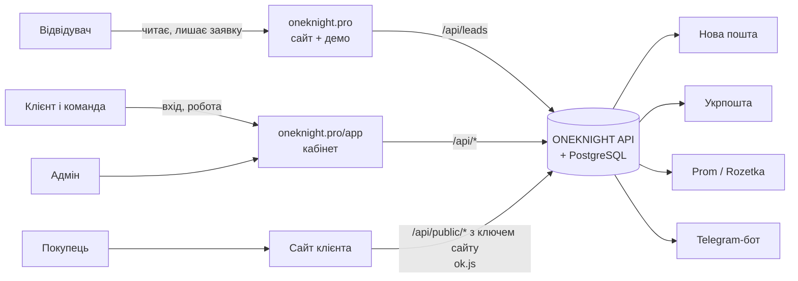
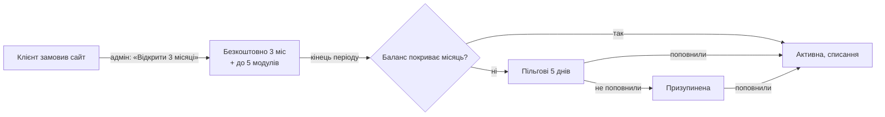

# ONEKNIGHT: архітектура проєкту

Карта проєкту: що є, для кого, де живе і як частини пов'язані. Технічні рішення по кроках (чому саме так) лежать у [docs/decisions.md](docs/decisions.md), API для сайтів клієнтів описано в [docs/public-api.md](docs/public-api.md), чого ще бракує від власника — у [TODO.md](TODO.md).

Стан на 29.09.2026: усе працює локально, домен `oneknight.pro` ще не підключений до сервера.

---

## 1. Три частини проєкту

| Частина | Адреса | Для кого | Навіщо |
| --- | --- | --- | --- |
| **Сайт ONEKNIGHT** | `oneknight.pro` (укр.), `oneknight.pro/en` | Відвідувачі, майбутні клієнти | Показати послуги, ціни, кейс, демо ONEKNIGHT і зібрати заявку |
| **Кабінет ONEKNIGHT** | `oneknight.pro/app` | Клієнти (власники бізнесу та їхня команда), адмін | Керувати сайтом, товарами, замовленнями, відгуками, аналітикою, доставкою, оплатою |
| **Сайти клієнтів** | домени клієнтів (наприклад `karpatu.shop`) | Покупці клієнтів | Продавати; товари, замовлення, відгуки, аналітика й вигляд беруться з ONEKNIGHT через публічний API |



---

## 2. Хто користується і що бачить

| Хто | Де працює | Що може |
| --- | --- | --- |
| **Відвідувач** | сайт | Читати, гратися з демо, залишити заявку (бриф) або написати в месенджер |
| **Власник бізнесу** (`owner`) | кабінет | Усе в своєму бізнесі: сайт, товари, замовлення, модулі, інтеграції, оплата, команда, резервні копії, назва бізнесу |
| **Менеджер** (`manager`) | кабінет | Те, що дав власник. За замовчуванням: замовлення, товари, відгуки, підтримка |
| **Маркетолог** (`marketer`) | кабінет | Те, що дав власник. За замовчуванням: аналітика, відгуки, сайт |
| **Покупець** | сайт клієнта | Купити, залишити відгук. Акаунта в ONEKNIGHT не має |
| **Адмін платформи** (Іван, `isAdmin`) | кабінет, режим «Адмінка» | Усі заявки, клієнти й сайти, відкриття пробного періоду, підтвердження поповнень, звернення в підтримку, ключі доступу й промокоди, посилання для зміни пароля |

Права задаються галочками в «Команді»: `orders`, `products`, `reviews`, `analytics`, `site`, `modules`, `billing`, `team`, `support`. Власник завжди має всі. Одна людина може бути в кількох бізнесах і перемикатися між ними вгорі кабінету. Сервер перевіряє права сам, інтерфейс лише ховає недоступне.

---

## 3. Сайт oneknight.pro

Одна довга сторінка, блоки по порядку:

| # | Блок | Для чого |
| --- | --- | --- |
| 1 | Hero (рідина WebGL) | Перше враження, кнопка «Замовити» |
| 2 | Хаос → система | Біль клієнта: розрізнені інструменти |
| 3 | Воронка | Як сайт перетворює відвідувачів на заявки |
| 4 | Послуги | 5 напрямів: сайти, автоматизація, аналітика, реклама, SEO/GEO/AI, з інтерактивом |
| 5 | Ціни | Типи сайтів від 7 000 / 12 000 / 14 000 / 15 000+ грн |
| 6 | Не шаблон | Порівняння шаблон vs система |
| 7 | Кейс Karpatu | Реальна робота |
| 8 | ONEKNIGHT: вступ | Що таке продукт |
| 9 | Демо ONEKNIGHT | Робоча демоверсія на вигаданих даних (позначено) |
| 10 | Модулі | Каталог модулів і ціни |
| 11 | Пропозиція | 3 місяці ONEKNIGHT безкоштовно й до 5 модулів із сайтом |
| 12 | Довіра | Чому можна довіряти (без вигаданих відгуків) |
| 13 | Процес | Етапи роботи |
| 14 | Підтримка | Що входить у підтримку |
| 15 | Про мене | Хто робить |
| 16 | Фінал | Останній заклик |

Також: юридичні сторінки `/legal/{privacy, terms, offer, cookies, oneknight-terms, subscription-terms, refund}`, сторінка 404, англійська версія `/en`.

**Куди веде заявка:** форма «Замовити» → `POST /api/leads` → заявка з номером у базі, сповіщення Івану в Telegram, видно в «Адміністрування → Заявки». Альтернатива: Telegram, Viber/WhatsApp, Facebook. Якщо людина вже увійшла, заявка прив'язується до її акаунта й бізнесу.

**Погоджені зміни сайту** (етап 9):
- **Сторінки й кнопки**: окрема сторінка ONEKNIGHT для тих, у кого сайт уже є (`/panel`), з повним демо і кнопкою «Спробувати зі своїми даними — 30 днів»; у шапці «Увійти» + «Замовити»; на першому екрані одна кнопка «Замовити».
- **Ціни й вартість**: у цінах 149 грн/міс і 30 днів безкоштовно; калькулятор вартості сайту «від — до».
- **Довіра й порівняння**: порівняння «таблиці й месенджери vs ONEKNIGHT» без назв конкурентів; FAQ на головній і на `/panel`; відгуки й галерея сайтів клієнтів — лише справжні, коли з'являться.
- **Заявка**: двокрокова (ім'я, телефон, тип → заявку прийнято; бриф за бажанням), потім «Що далі» + «Створіть кабінет, щоб бачити статус».
- **Контакти й запрошення**: плаваюча «Написати» лише на телефоні; реферальна смуга «Вас запросив бізнес X».
- **Інше**: маленьке повідомлення про cookies; сторінка статусу; спрощена рідина на слабких телефонах; блог пізніше. Анімовані сцени лишаються.

**Прокрутка:** звичайна, крім анімованих сцен (hero, хаос, «не шаблон», кейс, ONEKNIGHT, процес), де один жест доводить анімацію до наступного кадру.

---

## 4. Кабінет ONEKNIGHT (`/app`): логіка панелі

Погоджено з власником 29.09.2026 (135 питань, сирі відповіді — [docs/panel-answers.md](docs/panel-answers.md)). Принцип: у панелі лише те, що допомагає клієнту продавати, а тобі — продавати ONEKNIGHT. Що вже зроблено, а що ні, — у 4.16.

### 4.1. Каркас

- **Меню зліва, 4 групи:**
  - Робота: Головна · Замовлення · Клієнти · Товари · Відгуки · Аналітика
  - Сайт: Сайт
  - Розвиток: Модулі · Послуги
  - Налаштування: Бізнес (вкладки: Реквізити й документи · Робочі години · Замовлення · Оформлення · Клієнти · Цілі й пороги · Інтеграції) · Оплата · Команда

  Унизу: «Мій профіль» (особисте: профіль, безпека, сповіщення), «Підтримка», «На сайт», «Вийти».

  Розділ «Покупці» називається **«Клієнти»**, а список бізнесів в адмінці — **«Бізнеси»** (рішення G89, див. [docs/glossary.md](docs/glossary.md)). Інтерфейс для клієнта називаємо «панель ONEKNIGHT».
- **Верхня панель**:
  - перемикач бізнесу (якщо кілька) і перемикач сайту («Усі сайти» або один, видно при 2+ сайтах);
  - **глобальний пошук** (клавіша `/`) по замовленнях, покупцях, товарах, ТТН і телефону;
  - дзвіночок, користувач.
- **Телефон**: нижня панель Головна · Замовлення · Покупці · Товари · «Ще». Окремого застосунку (PWA) не робимо.
- **Тема**: як у системі + перемикач. **Мова**: українська + англійська.
- **Некуплений модуль**: пункт видно із замком. Усередині — що дає, ціна, «Підключити». Без права `modules` показуємо «Попросіть власника».
- **Підказки й продаж модулів у контексті** (Q07). Наприклад, у замовленні без ключа: «Підключіть Нову пошту — ТТН в один клік».
- **Довідка**: «?» біля кожного розділу (коротко, як це працює).
- **Банер акції** від адміна (можна закрити) і **«Що нового»** в дзвіночку.
- **Порожній кабінет**: приклад замовлень із позначкою «приклад», доки не прийде перше справжнє.
- **Експорт у Excel** у кожному списку.
- **Правило розміщення**: купівля — у «Модулях», доступи — в «Інтеграціях», робота — там, де вона відбувається.

### 4.2. Права й ролі

- Галочки прав: `orders` (замовлення й покупці), `shipping` («Відправка»: лише замовлення, що чекають відправки), `products`, `reviews`, `analytics`, `site`, `modules`, `billing`, `team`, `support` і **`finance` — «Бачить фінанси»** (виручка, суми, прибуток, ціль). Без `finance` суми не приходять із сервера взагалі: списки й деталі замовлень, Головна, аналітика, дзвіночок і Telegram («Нове замовлення №1041» без суми), форма ТТН (накладений платіж підставляється сам, суму не видно).
- Рішення 29.09.2026: менеджер за замовчуванням **без** `finance` (власник ставить галочку сам); у дзвіночку людина бачить лише ті сповіщення, на які має право (як у Telegram).
- Готові ролі для запрошення:
  - **Менеджер**;
  - **Маркетолог**;
  - **Комплектувальник** (`shipping`): бачить лише підтверджені, оплачені й відправлені замовлення, оформлює й друкує ТТН, ставить «Відправлено»; нові не підтверджує, не скасовує, не редагує; грошей не бачить. Його Головна — «Відправити сьогодні» й «Підтверджені без ТТН».

  Власник має все.
- **Журнал дій команди** для власника: хто що змінив.
- Власник може **вимагати 2FA** для всієї команди.

### 4.3. Головна

1. **Період**: Сьогодні · 7 днів (за замовчуванням) · 30 · 90, запам'ятовується; порівняння з попереднім періодом.
2. **Цифри**: виручка (усі замовлення, крім скасованих), візити, конверсія візит → замовлення, % скасувань. Суми в гривні (інші валюти — за курсом НБУ).
3. **Графік**: виручка й замовлення разом.
4. **Ціль на місяць**: «виконано 64%, прогноз 110%».
5. **Що треба зробити** (кожен пункт веде у відфільтрований список, можна «нагадати завтра»):
   - нові замовлення (стають **терміновими через 2 год** без підтвердження, з урахуванням робочих годин);
   - підтверджені без ТТН;
   - «не додзвонились» — час передзвонити;
   - посилка чекає у відділенні 3+ днів — подзвонити покупцю;
   - відмова / повернення;
   - відгуки на модерації;
   - товар закінчується (поріг на кожен товар);
   - незавершені кошики;
   - сайт недоступний / SSL / не підтверджено;
   - баланс, пільгові дні;
   - відповідь підтримки.
6. **Відправити сьогодні**: список + «Надрукувати всі ТТН».
7. **Останні відгуки**.
8. **Підказки**: до 3 найважливіших, серед них пропозиції твоїх послуг (мало візитів з Google → SEO; багато візитів, мало замовлень → аудит).
9. **Швидкі дії**: «+ Замовлення», «+ Товар», «Надрукувати ТТН на сьогодні».
10. **Перші кроки** для нового клієнта: додати сайт → вставити `ok.js` → додати товари → запустити підписку → 2FA → Telegram. **Нагорода за все: +7 днів безкоштовно.**

Поки кабінет відкритий: нове замовлення — **звук + спливаюче вікно**. Щовечора власнику в Telegram **підсумок дня**.

### 4.4. Замовлення (право `orders`)

**Список і дошка**
- Список + **дошка за статусами** (перетягувати). Порядок: спершу термінові, потім нові.
- Колонки: номер, дата, покупець, телефон, товари, сума, ТТН + стан посилки, оплата, джерело.
- Фільтри: статус, джерело (сайт, Prom, Rozetka, вручну), оплата; пошук.
- **Нумерація своя в кожному бізнесі з 1001.**
- **Масові дії**: змінити статус, створити ТТН, надрукувати всі наклейки одним PDF, Excel.

**Статуси**
- Бізнес додає **свої статуси**, кожен належить до базової групи: Нове · В роботі · Відправлено · Завершено · Скасовано · Повернення. Автоматика працює за групами.
- **Скасування — з обов'язковою причиною** (передумав, немає в наявності, не додзвонились, дубль, інше).
- **Автоматично за доставкою** (перевірка щогодини):
  - ТТН створено → Відправлено;
  - отримано → Завершено;
  - відмова → Повернення; коли посилка повернулась, товар іде на склад, а покупець отримує мітку «Проблемний».

**Оплата** — окремо від статусу: не оплачено / передоплата / оплачено / кошти повернуто. **Передоплата при накладеному**: накладений = сума − передоплата. Ручних знижок у замовленні немає.

**Картка замовлення**
- Покупець (посилання в «Покупці»), товари, доставка, оплата, статус.
- «Оформити ТТН» → друк (Нова пошта, Укрпошта).
- Документи: **видаткова накладна**, **гарантійний талон**, **рахунок-фактура** покупцю (для опту) — з реквізитами бізнесу клієнта (Налаштування → Реквізити бізнесу), без даних ONEKNIGHT.
- **Внутрішні коментарі** команди.
- **Відповідальний** — хто перший відкрив/підтвердив.
- **«Не додзвонились»** → нагадування через 2 год.
- **Редагування до відправлення** з історією змін.
- **Попередження про дубль** (той самий телефон за 24 год) з пропозицією об'єднати.
- Покупець «Проблемний» → червоне попередження й порада «лише передоплата».

**Ручне замовлення**
- Покупець із бази або новий, товари з каталогу або **довільний товар (назва + ціна)**, доставка, оплата.
- Джерело: дзвінок, Instagram, Viber, Telegram, Facebook, TikTok, особисто + свої.

**Інше**
- Залишок знімається при створенні й повертається при скасуванні.
- Одне замовлення = одна посилка.

### 4.5. Покупці (право `orders`)

- **База сама із замовлень** (один телефон = один покупець у бізнесі), плюс ручні замовлення й **імпорт з Excel**. Можна **об'єднати** два записи.
- **Картка**:
  - ім'я, телефон, пошта;
  - адреса/відділення за замовчуванням, звідки прийшов уперше, компанія + ЄДРПОУ;
  - цифри: скільки купив, кількість замовлень, останнє замовлення;
  - усі замовлення, відгуки, **нотатки** (бачить уся команда з доступом).
- **Кнопки біля телефону**: зателефонувати, Viber, Telegram, WhatsApp, скопіювати.
- **Мітки**: готові + свої з кольором.
  - VIP, Опт — вручну;
  - «Постійний» — сама після 3 завершених замовлень;
  - «Проблемний» — сама після **1 відмови** від посилки.
- **Сегменти**: нові, постійні, сплячі (90+ днів без покупки), топ за сумою, ризикові.
- Прохання видалити дані → **знеособлення**: ім'я й телефон стираються, замовлення лишаються в цифрах.
- Особистого кабінету для покупців немає.

### 4.6. Повідомлення покупцям — майбутнє (платне, зараз не будуємо)

Потребує платного сервісу (Viber/SMS), тому зараз лише ідея й структура. Поки що — кнопки «зателефонувати / Viber / Telegram / WhatsApp» біля телефону покупця і список незавершених кошиків для дзвінка.


- **Канал**: спершу **Viber** (дешевше), якщо не доставлено — **SMS**. Оплата **з балансу ONEKNIGHT з твоєю націнкою**.
- **Автоповідомлення** (готові шаблони, бізнес може редагувати):
  - замовлення прийнято;
  - відправлено + ТТН;
  - прибуло у відділення;
  - нагадування забрати;
  - **прохання відгуку через 1 день** після отримання.
- **Розсилки акцій** за сегментами — лише тим, хто дав згоду, з відпискою.
- **Незавершені кошики**: список для дзвінка — зараз; нагадування покупцю — разом із повідомленнями.
- **Бонуси/кешбек** — окремим модулем. Промокоди для покупців сайту — пізніше. Привітання з днем народження — не робимо.

### 4.7. Товари (право `products`)

- **Каталог окремо на кожен сайт.**
- **Категорії з підкатегоріями.** Варіантів (розмір/колір) немає: кожен варіант — окремий товар.
- **Поля**:
  - назва, ціна (у валюті сайту), залишок, **кілька фото**;
  - артикул, **стара ціна**, **собівартість → прибуток**;
  - **вага й розміри → самі підставляються в ТТН**;
  - характеристики.
- **Наявність**: в наявності / під замовлення (N днів) / очікується / немає. **Поріг «закінчується»** на кожен товар.
- **Масово**: імпорт з Excel і з Prom (YML), зміна цін на %, експорт. Склад один.
- Синхронізації з маркетплейсами немає.

### 4.8. Сайт, аналітика, відгуки

**Сайт** (зміни — право `site`)
- Клієнт сам додає домен → код `ok.js` → **підтвердження, коли скрипт знайдено на домені**.
- Кожен додатковий сайт — **+149 грн/міс**. Валюта задається на сайт.
- Моніторинг кожні 5 хв; ключ сайту й API.
- **Щотижнева перевірка якості** (швидкість, мобільна версія, SEO, биті посилання) з порадами й пропозицією твоїх послуг.
- Посилання «Зроблено на ONEKNIGHT» — за бажанням клієнта.
- **Соціальний доказ** на сайті: «Олена з Києва купила … 5 хв тому» — лише справжні замовлення, без прізвищ.
- «Вигляд сайту» (анімації кнопок, звуки) **прибрано** (кабінет, API, `ok.js`, демо).

**Аналітика** (модуль, право `analytics`)
- Звіти:
  - джерела й UTM;
  - **воронка візит → товар → кошик → замовлення**;
  - товари: перегляди vs покупки;
  - сторінки, пристрої, міста;
  - **окупність реклами** (витрати вводяться вручну).
- **Кліки на телефон, Viber, Telegram** рахуються як контакти.
- Зберігається 13 місяців.

**Відгуки** (модуль, право `reviews`)
- **Усі на модерацію**; поганий відгук — звичайне сповіщення.
- **Публічна відповідь** бізнесу.
- **Дані зірок для Google**; **імпорт відгуків** з Prom / Rozetka (через їхні інтеграції) і з Google — лише якщо клієнт сам підключить свій Google Business Profile в «Інтеграціях» і дасть доступ.
- Креатив для Instagram лишається.

### 4.9. Розвиток і налаштування

**Модулі**: каталог, опис, ціна, «Підключити» / «Вимкнути». Нові модулі з відповідей: **Повідомлення** (Viber/SMS), **Бонуси**.

**Послуги**: замовити роботу + «Ваші заявки». Проєкти сайтів видно тут: **етапи, дедлайн, що потрібно від клієнта, оплати частинами** (4.11).

**Інтеграції**: лише доступи (Нова пошта, Укрпошта, Prom, Rozetka, Google Business Profile клієнта — для відгуків).

**Оплата** (право `billing`)
- Стан підписки, **«Почати підписку»**.
- **Пробний період 30 днів**, якщо ONEKNIGHT купують без сайту; 3 місяці + 5 модулів — із сайтом.
- **Оплата за рік — 2 місяці в подарунок.**
- Баланс, поповнення на IBAN; ключ або промокод; історія.
- **«Через ONEKNIGHT пройшло N замовлень на X грн»**.
- Позначка «Підтримка за договором до …».
- Нагадування про оплату **за 3 дні**. Після пробного періоду без грошей: 5 пільгових днів, потім лише перегляд (сайт працює).
- Дані видаляються через **90 днів** призупинення, з попередженнями.
- Видалити бізнес — лише через підтримку.

**Команда**: запрошення, ролі (4.2), журнал дій, вимога 2FA.

**Профіль і безпека** — вкладки:
- Профіль: ім'я, телефон, назва бізнесу, пароль, **реферальне посилання** (обом по місяцю безкоштовно, лічильник);
- Реквізити бізнесу (власник): ФОП/ТОВ, ЄДРПОУ/ІПН, IBAN, адреса — для накладної й рахунку-фактури покупцям;
- Безпека: 2FA, сеанси, історія входів, **вхід з нового пристрою → Telegram із «Це не я»**. Вхід тримається **7 днів**. Видно, коли адмін переглядав кабінет;
- Сповіщення: таблиця «подія × кабінет / Telegram», звук, **тихі години поза робочими годинами** (крім «сайт упав»);
- Робочі години бізнесу;
- Резервні копії (власник).

### 4.10. Підтримка

- Звернення з фото + кнопка «Написати в Telegram».
- Очікуваний час відповіді: до 48 год, за договором підтримки — швидше.
- **«Запропонувати ідею»** → адмінка.

### 4.11. Режим адміна

Перемикач **«Мій бізнес / Адмінка»**. Меню адмінки:

| Розділ | Що там |
| --- | --- |
| Огляд | Щомісячний дохід, реєстрації, пробні → платні, відтік, хто в пільгових днях, воронка заявок, популярність модулів; **список «Ризик відтоку»** (не заходив 14 днів, немає замовлень, скоро оплата) |
| Заявки | **Воронка продажу**: нова → зв'язались → пропозиція → передоплата → в роботі → здано / відмова; нотатки, нагадування |
| Проєкти | Сайти в роботі: етапи, дедлайн, оплати частинами; клієнт бачить прогрес у «Послугах» |
| Клієнти | Бізнеси, сайти, підписка, пробний період, «Підтримка за договором», **коригування балансу з причиною**, посилання для зміни пароля, **перегляд кабінету клієнта (лише читання, у журнал)** |
| Звернення | **Шаблони відповідей, таймер очікування, клієнти з договором угорі** |
| Поповнення | Підтвердження переказів |
| Ключі й промокоди | Як зараз |
| Комунікації | **Повідомлення всім або сегменту** (пробні, з боргом, з модулем X), банер акції, «Що нового», ідеї клієнтів |

Тобі в Telegram: нова заявка, реєстрація, поповнення, звернення, сайт клієнта впав, ідея. **Щоранку — звіт.**

### 4.13. Дизайн і взаємодія

Погоджено 29.09.2026 (132 питання, сирі відповіді — [docs/design-answers.md](docs/design-answers.md)).

**Характер**
- Спокійний робочий інструмент, щільність збалансована, фірмовий синій акцент, округлі кути, шрифт Geologica, лінійні іконки.
- Суми й номери — цифрами однакової ширини; гроші пишемо «1 100 грн»; час — «2 год тому», точний при наведенні; усе за Києвом.
- Звертання на «ви». Емодзі лише в Telegram.
- Лицар у меню і як анімація завантаження.
- Плавні переходи між екранами (з урахуванням «зменшити рух» у системі).
- Звуки лише важливі: власний звук нового замовлення (можна вимкнути), помилка.
- Статуси: фіксований колір групи + іконка/текст (не лише колір).
- Святкування (перше замовлення, ціль) — стримана картка.

**Розкладка**
- Списки — таблиці з сортуванням, на всю ширину; форми вужчі.
- Деталі — панель справа.
- Меню згортається до іконок (запам'ятовується); планшет — як комп'ютер зі згорнутим меню.
- Логотип бізнесу клієнта — угорі панелі й у документах.

**Кнопки й стани**
- Головна кнопка контрастна (як на сайті).
- У довгих формах — смуга «Зберегти» внизу, коли є зміни; перемикачі й статуси зберігаються одразу; попередження «є незбережені зміни».
- Видалення й зміна статусу — одразу + «Скасувати» 7 с.
- Окреме вікно підтвердження: масові дії над 5+ записами, скасування замовлення, вимкнення модуля, відключення інтеграції, видалення людини з команди.
- Повідомлення внизу справа: успіх 4 с, помилки — доки не закрити.
- Завантаження — анімований лицар.
- Помилки форм — під полем + прокрутка до першої.
- Немає мережі — смуга, повтор сам, зміни не губляться.

**Списки**
- Часті фільтри кнопками + «Фільтри»; збережені вигляди («Мої нові», «Без ТТН»).
- Сторінки по 50.
- Зміна статусу / залишку / ціни прямо в таблиці.
- Дії в рядку при наведенні + «⋯».
- Колонки можна ховати.
- Кнопки «скопіювати».
- PDF у новій вкладці; «Лист пакування на сьогодні».

**Клавіші й дрібниці**
- Клавіші: `/` пошук, `N` нове, `Esc`, `↑↓`, `?` довідка. Підказки на іконках.
- Вкладка браузера «(3) Замовлення · ONEKNIGHT».
- Дзвіночок групує «Сьогодні / Вчора / Раніше».
- Перемикач **«Приховати суми й телефони»**.
- Розмір тексту в налаштуваннях.
- Версія й «Що нового» внизу меню.
- Доступність на рівні WCAG AA.

**Нове замовлення** (кабінет відкритий): вікно з №, сумою, товарами, покупцем + «Відкрити» / «Підтвердити». Кілька одразу — одне вікно зі списком.

**Телефон**
- Замовлення — картки зі свайпами (вправо — підтвердити, вліво — «не додзвонились») і кнопкою дзвінка.
- Деталі на весь екран.
- Кругла «+» над нижньою панеллю.
- ТТН з телефону — «Надіслати PDF у мій Telegram».

**Опитування**: через 30 днів і далі раз на 3 місяці — «Наскільки ймовірно, що порадите?»; оцінка 9–10 → пропозиція реферального посилання. Результати в адмінці.

### 4.14. Шлях модуля

1. **Знаходить**:
   - каталог «Модулі» з «Рекомендовано для вас» (за даними бізнесу);
   - замок у меню;
   - підказки в роботі;
   - модулі «у розробці» з кнопкою «Повідомте, коли буде» (ти бачиш попит).
2. **Читає**: картка (вигода, 3 пункти «що вміє», що потрібно, де з'явиться, «99 грн/міс · ≈3 грн на день») → панель справа з деталями.
3. **Купує**: вікно «Сьогодні спишемо X грн, далі 99 грн разом із підпискою». Не вистачає грошей — там же «Поповнити на X грн» з реквізитами; модуль увімкнеться, щойно гроші надійдуть. Знижок за кількість немає. Оплата при підключенні посеред місяця поки повна (питання про пропорційну оплату відкладено).
4. **Налаштовує**:
   - потрібен ключ → одразу крок 2 з тим самим блоком, що в «Інтеграціях», без переходу;
   - потрібен `ok.js` → перевірка, чи стоїть, інструкція + «Надіслати інструкцію розробнику»;
   - нічого не потрібно → одразу відкривається його розділ.

   Наприкінці — «Готово, ось де це працює».
5. **Бачить**:
   - позначка «Нове» в меню, доки не відкриє;
   - картка «що тут є й перший крок» при першому відкритті;
   - вкладка **«Мої модулі»** зі станом (працює / потрібен ключ / помилка) і користю («цього місяця: 34 ТТН»);
   - кнопки й значки в замовленнях.
6. **Проблема** (немає ключа, ключ зламався): червона крапка на «Інтеграціях», пункт у «Що треба зробити», Telegram.
7. **Вимикає**: вікно підтвердження + необов'язкове «чому» (падає в адмінку). Модуль працює до кінця оплаченого місяця. Дані зберігаються 90 днів — увімкнув знову, усе на місці.
8. **Пробний період закінчився**: усі модулі лишаються й стають платними.

### 4.15. Реєстрація й перший вхід

**Реєстрація**
- Поля: ім'я, телефон (маска +380), пошта, пароль (від 8, з «показати»). Назву бізнесу — потім.
- Текст «Реєструючись, ви погоджуєтесь з умовами».
- Код запрошення схований під «Є код запрошення?».
- Пошта вже є → «Акаунт уже є» + «Увійти» з підставленою поштою.

**Одразу після реєстрації**
- Обов'язкові питання (без пропуску): «Сайт уже є?», «Що продаєте?», «Як доставляєте?», «Де ще продаєте?». За відповідями — порада модулів і шлях: є сайт → додати його; немає → замовити.
- Вікно «Підключіть Telegram».
- Пробні 30 днів (без сайту від нас) стартують кнопкою «Почати пробний період». Далі невеликий лічильник угорі «Пробний: 23 дні» → «Оплата»; нагадування за 3 дні й за 1 день.
- Приклад замовлень зникає з першим справжнім + кнопка «Прибрати приклад».
- 2FA необов'язкова, пункт у «Перших кроках».
- Мова кабінету — за версією сайту, з якої прийшли.

**Вхід**
- Картка по центру + «Спробувати демо без реєстрації».
- Кнопки Google/Telegram сховані, доки не працюють.
- Забув пароль → сам через Telegram-бот, якщо Telegram був підключений; інакше — через адміна.
- Сеанс закінчився посеред роботи → вікно входу поверх, повернення на те саме місце.

**Команда й кілька бізнесів**
- Запрошена людина першим бачить свій розділ (менеджер — Замовлення, маркетолог — Аналітика).
- Ще один бізнес — «+ Новий бізнес» у перемикачі; кожен платить окремо.

### 4.17. Гроші покупців, сайт клієнта, адмінка, юридичне, запуск

Раунд 3 (100 питань, сирі відповіді — [docs/extra-answers.md](docs/extra-answers.md)).

**Гроші покупців**

Модулі й підключення:
- **Оплата карткою** — модуль: клієнт підключає свій еквайринг (Monobank / LiqPay / WayForPay), оплата сама ставить «Оплачено».
- **Фіскальні чеки** — інтеграція зі своїм ПРРО клієнта (напр. Checkbox), чек при оплаті.
- **Переказ на IBAN клієнта**: покупець бачить реквізити й призначення «Замовлення №…», менеджер відмічає оплату.

Налаштування сайту клієнта (з кабінету):
- способи оплати й доставки (з пошуком відділень через наш API);
- мінімальна сума;
- доставку за замовчуванням платить отримувач.

Облік:
- у формі ТТН — вартість доставки й комісія за накладений платіж;
- повернення коштів покупцю — запис «Повернено X грн, як, коли»;
- **звіт доходу для ФОП** (квартал, Excel);
- **витрати** за категоріями → прибуток на Головній (право «Фінанси»);
- валюти — курс НБУ щодня, без перерахунку для покупців.

Документи й реквізити:
- реквізити змінює лише власник: **перемикач «Платник ПДВ»**, підпис і печатка картинками;
- номер накладної/рахунку = номер замовлення;
- строк гарантії задається в товарі й рахується від отримання.

Згода покупця на сайті: текст + окрема галочка на розсилки.

**Сайт клієнта через API**

Товари на сайті:
- SEO-поля товару заповнюються самі (можна змінити); адреси сторінок — справа сайту;
- фото стискаються й нарізаються автоматично;
- «Залишилось N шт.», коли залишок ≤ порогу;
- позначки «−X%» (зі старої ціни), «Новинка» (14 днів), «Хіт» (вручну);
- супутні товари (з історії + вручну);
- пошук з помилками;
- порядок перетягуванням;
- англійські тексти товару (необов'язково).

Оформлення й сторінки:
- поля оформлення налаштовуються з кабінету;
- точки самовивозу;
- тексти сторінок «Доставка й оплата», «Повернення», «Контакти» з налаштувань;
- банер на сайті з датами показу;
- календар вихідних.

Для розробників сайту:
- **вебхуки** з підписом (повтори 24 год, журнал доставок);
- **сторінка документації API**;
- ліміт 120 запитів/хв на сайт.

Чого не робимо: фідів Google/Facebook, тестового режиму, галочки «Не передзвонюйте». Автопідтвердження оплачених карткою теж немає: замовлення завжди підтверджує людина.

**Адмінка: проєкти сайтів і клієнти**

Заявки й проєкти:
- заявка без контакту 4 год (у робочий час) → нагадування;
- **комерційна пропозиція PDF** з шаблону; договір — пізніше.
- **Проєкт**: передоплата 50% через твій IBAN з кодом платежу; етапи Бриф → Дизайн → Розробка → Наповнення → Запуск; клієнт **погоджує кожен етап** (лічильник правок); чек-лист «що потрібно від вас» із завантаженням; коментарі + Telegram.
- **Після запуску сайту автоматично**: 3 місяці ONEKNIGHT + 5 модулів, сайт доданий і підтверджений, прохання відгуку про твою роботу.

Робота з клієнтами:
- мітки й нотатки на клієнтах;
- твої задачі з нагадуваннями в Telegram;
- індивідуальна ціна з датою до;
- пауза для сезонних бізнесів (через тебе);
- подарувати модуль на N місяців;
- реферали з захистом від зловживань.

Технічне:
- журнал помилок сервера й браузерів клієнтів;
- анонімна статистика використання панелі;
- антиспам як зараз.

Чого не робимо: зовнішнього монітора ONEKNIGHT, звіту доходу по місяцях.

**Тексти й юридичне**

Хто сторона договору:
- поки ти як фізособа; **ФОП зареєструєш пізніше** (після паспорта);
- **гроші від клієнтів приймаємо лише після реєстрації ФОП** (TODO);
- юридичні тексти пишу чернетками з місцем для реквізитів, юрист перевіряє перед запуском.

Що має бути в умовах і політиці:
- договір обробки персональних даних (клієнт — власник даних, ONEKNIGHT — обробник);
- список отримувачів даних (Нова пошта, Укрпошта, Telegram, OVHcloud, маркетплейси);
- дані зберігаються в ЄС (OVHcloud);
- про зміну умов — смуга за 14 днів;
- клієнти — бізнеси в Україні, 18+;
- шаблони юридичних сторінок для сайтів клієнтів (з їхніми реквізитами, «перевірте з юристом»).

Назви й тон:
- ONEKNIGHT великими;
- модулі — назвою сервісу;
- «ТТН» для обох перевізників;
- помилки: що сталося + що робити + дрібний код;
- словник термінів у проєкті;
- англійські тексти як є.

Довідка й зв'язок:
- **довідка**, перші статті: підключити сайт і ok.js, ключ Нової пошти, перше замовлення від і до, додати менеджера, оплата, відгуки; відео пізніше;
- підтримка Пн–Пт 10:00–18:00;
- «Що нового» — коли виходить помітне.

**Telegram і пошта**: під сповіщенням кнопка «Відкрити замовлення»; дії «Підтвердити» й «Не додзвонились» прямо з Telegram. Пошту (email) не надсилаємо ніколи.

**Безпека, якість, запуск**
- Безпека:
  - 2FA для адміна обов'язкова;
  - резервних кодів і passkeys немає.
- Копії даних:
  - щоденний бекап OVH;
  - **щотижнева зашифрована копія бази тобі в Telegram**.
- Строки зберігання:
  - повне видалення бізнесу — через 30 днів після запиту;
  - журнали: дії й входи — рік, помилки — 90 днів.
- Оновлення сервера — будь-коли.
- **Запуск**: закрита бета на **5 бізнесів**, їм **6 місяців безкоштовно**.
- Якість кожного етапу:
  - тести сервера + тести в браузері + скриншоти (світла/темна тема, телефон);
  - екрани відкриваються до 1 с;
  - **ти перевіряєш етап сам у локальному кабінеті**.
- Демо на сайті оновлюємо під нову панель у кінці.

### 4.18. Аналітика, інтеграції, команда, ціни, бонуси (раунд 4)

Сирі відповіді — [docs/round4-answers.md](docs/round4-answers.md).

**Аналітика й звіти**
- Джерело замовлення рахується за першим візитом. Візити команди бізнесу не рахуються.
- **«Зараз на сайті: N»**. Замовлення з'являються одразу, візити — раз на кілька хвилин.
- **Звіти**:
  - порівняння сайтів;
  - «які товари дають 80% виручки»;
  - повторні покупки;
  - менеджери (бачить лише власник);
  - доставка (дні в дорозі, % відмов за містами й перевізниками);
  - **«Гроші в дорозі»** (накладені платежі, що ще не надійшли);
  - звірка накладених платежів з Новою поштою, якщо її API це дає;
  - пошукові запити без результатів з порадою «додайте товар».
- **Прогнози**: виручка до кінця місяця, «товар закінчиться через ~N днів». Сезонність з'явиться сама, коли буде рік даних.
- **Пояснення змін простими словами** (правила, без AI).
- **Інструменти**: конструктор UTM-посилань і QR-кодів для офлайн-реклами.
- **Вивантаження**: Excel, PDF. **Щомісячний PDF-звіт** у Telegram 1-го числа.
- Картки Головної кожен ховає й показує сам.

**Інтеграції й бот**
- **Нова пошта**:
  - види доставки: відділення, поштомат, кур'єр;
  - накладений платіж — налаштування бізнесу (грошовий переказ або «Контроль оплати»);
  - оголошена вартість = сума замовлення;
  - список адрес відправлення;
  - **ТТН повернення**;
  - номер замовлення в описі вантажу;
  - «Крихке» з позначки в товарі;
  - запропонувати об'єднати кілька замовлень одного покупця;
  - виклик кур'єра — пізніше.
- **Укрпошта**: Стандарт за замовчуванням.
- **Prom / Rozetka**:
  - імпорт кожні 5 хв;
  - **статуси й номер ТТН передаються назад**;
  - **чат покупців маркетплейсу в ONEKNIGHT**;
  - кожну можливість спершу перевіряю в їхньому API.
- **Telegram-бот** (спільний @oneknight_bot):
  - `/today`, `/new`, пошук за телефоном або ТТН;
  - сповіщення в **Telegram-групу команди**;
  - про статуси пише лише важливе (нове, відмова, повернення, посилка чекає).
- **Не робимо**: Google Sheets. Instagram/Facebook Direct — пізніше.

**Команда**
- Розподіл замовлень:
  - **«Взяти в роботу»** + автопризначення першому, хто підтвердив;
  - видно, хто зараз відкрив замовлення;
  - менеджер бачить усі або свої + нерозподілені (налаштування на людину).
- Спілкування: @згадки в коментарях.
- Для власника:
  - навантаження команди;
  - звіт по менеджерах;
  - видалення товарів і скасування — у щоденному підсумку.
- Для менеджера: блок «Моє» на Головній.
- Доступи й захист бази:
  - вивантаження бази — **лише власник**;
  - комплектувальник бачить телефон частково;
  - тимчасовий доступ із датою закінчення;
  - видалена людина → її відкриті замовлення стають нерозподіленими;
  - історія змін у картці товару;
  - робочі контакти колег видно в «Команді».
- **Не робимо**: відсотків менеджерам, співвласників (передача бізнесу — через підтримку), зміни цін менеджерами, обмеження входу за годинами.

**Перехід, кілька бізнесів, ціни, бета**
- **Перехід з інших систем**: шаблони Excel + пізніше прямі перенесення. «Перенесемо за вас» — **завжди безкоштовно**.
- **Бета**:
  - Karpatu + 4 знайомі магазини;
  - **усі модулі** 6 місяців безкоштовно;
  - «Запропонувати ідею» + дзвінок раз на місяць;
  - завершується, коли ти вирішиш.
- **Кілька бізнесів однієї людини**: **спільний гаманець** (зараз баланс у кожного бізнесу свій — міняємо); один дзвіночок із назвою бізнесу.
- **Пробні й реферали**:
  - один пробний період на номер телефону;
  - реферальний місяць — після першої оплати запрошеного;
  - наприкінці пробного пропонуємо й річну оплату.
- **Ціни**:
  - зміна цін — попередження за 30 днів;
  - промокод і річна знижка не складаються;
  - окремої знижки клієнтам сайтів після 3 місяців немає.
- **Річна оплата**:
  - модулі лишаються щомісячними;
  - за 14 днів до кінця — пропозиція продовжити;
  - пішли посеред року — повертаємо невикористані місяці мінус 2 подарункові.
- **Гроші від клієнтів**:
  - перекази без коду — ти прив'язуєш вручну;
  - часткове поповнення в пільгові дні не знімає пільговий стан;
  - мінімальне поповнення 50 грн.

**Відгуки, бонуси, кошики, оплата карткою**
- **Відгуки**:
  - просимо через **QR-код у накладній / листі пакування**;
  - форма на сайті клієнта;
  - нові зверху;
  - бонусів за відгук немає.
- **Модуль Бонуси**:
  - відсоток задає бізнес;
  - діють 90 днів;
  - до 30% замовлення;
  - нараховуються після «Завершено»;
  - покупець їх не бачить (лише менеджер).
- **Незавершені кошики**: через 2 год; «Оформити замовлення» з кошика одним кліком.
- **Оплата карткою**:
  - не пройшла → «не оплачено» + покупцю посилання повторити;
  - **повернення на картку з кабінету**;
  - комісія еквайрингу автоматично у витратах;
  - посилань на оплату для ручних замовлень немає.
- **Фіскальні чеки**: лише для оплат карткою; посилання на чек на сторінці «Дякуємо» і в замовленні.
- **Соціальний доказ**: не частіше ніж раз на 45 с, лише замовлення за 48 год.

### 4.19. Налаштування, картки, Головна, адмінка, довідка (раунд 5)

Сирі відповіді — [docs/round5-answers.md](docs/round5-answers.md). Словник — [docs/glossary.md](docs/glossary.md).

**Налаштування**
- «**Бізнес**» (лише власник), вкладки:
  - Реквізити й документи;
  - Робочі години й вихідні;
  - Замовлення (статуси, причини скасування, джерела, терміновість);
  - Оформлення (оплата, доставка, мін. сума, поля, самовивіз);
  - Клієнти (мітки, сплячі);
  - Цілі й пороги;
  - **Інтеграції** (окремого пункту меню більше немає);
  - відповіді з реєстрації.
- Налаштування конкретного сайту (валюта, сторінки, банер, соцдоказ, поля, шаблон адреси товару) — у «Сайті».
- Способи оплати й доставки: бізнес задає, сайт може змінити.
- Значення за замовчуванням — з відповідей при реєстрації.
- Пошук налаштувань через «/».
- «Скинути до стандартних» на кожній вкладці.
- Зміни важливих налаштувань пишуться в журнал.
- Бракує реквізитів при друці → вікно заповнення прямо там.
- **Документи**: повний редактор шаблонів (накладна, талон, рахунок), формат A4, мова обирається при друці, дати 29.09.2026.
- **Гаманець** людини — у «Оплаті»; бачить і поповнює лише власник. Команда бачить лише стан підписки.
- **Сповіщення**: бізнес задає за замовчуванням, людина змінює.
- **Ціль місяця**: задає власник, ONEKNIGHT пропонує за минулими місяцями.

**Картки**
- Замовлення:
  - нагорі №, статус, сума й усі дії одразу (кнопки, що змінюється сама, немає);
  - усі розділи відкриті, прокрутка;
  - **одна стрічка історії** (статуси, коментарі, ТТН, зміни, дзвінки);
  - міні-картка клієнта;
  - шлях посилки з датами;
  - зміна кліком по полю;
  - окремі кнопки друку;
  - клавіші C/T/P;
  - на телефоні смуга дій унизу.
- Товар:
  - фото зліва: перетягування, кілька файлів, вставка з буфера, обрізка;
  - цифри продажів і прибутку;
  - дублювання;
  - **«В архів»** (видалити — лише без замовлень);
  - «Подивитись на сайті» за шаблоном адреси;
  - дерево категорій зліва.
- Клієнт:
  - нагорі мітки, сума покупок, кнопки зв'язку;
  - одна стрічка;
  - дії: нове замовлення, нотатка, об'єднати, знеособити.

**Головна й сповіщення**
- Головна:
  - «Перші кроки» угорі;
  - «Що треба зробити» поруч із «Відправити сьогодні»: видно 5 пунктів + «Показати всі», спершу те, що стосується грошей.
- Своя Головна за роллю:
  - комплектувальник — лише відправки й друк;
  - маркетолог — візити, джерела, конверсія, відгуки.
- Ціль виконана → привітання + нова ціль.
- **Щоденний підсумок** у Telegram (час обирає людина): замовлення й виручка, відправки й відмови, що зробити завтра, дії команди.
- Telegram «Нове замовлення»: №, сума, товари, місто й доставка, оплата, джерело, ім'я й телефон клієнта.
- Дзвіночок відкриває об'єкт у панелі справа; сповіщення зберігаються 30 днів.
- **Сповіщення браузера** — за згодою.
- Вкладка блимає «(1) Нове замовлення».
- Сайт упав → одне сповіщення + «знову працює» (власнику й людям із правом «Сайт»).
- «Не додзвонились» → дзвіночок + Telegram відповідальному.
- «Посилка чекає» — щодня до отримання.
- Формат сповіщень: заголовок + один рядок.

**Адмінка**
- Огляд: спершу твої справи, потім цифри.
- **Бізнеси**:
  - таблиця: власник, стан, баланс, модулі, останній вхід, замовлення за місяць, мітки, договір;
  - картка з вкладками.
- **Заявки й проєкти**:
  - дошки за етапами;
  - заявка → «Почати проєкт» створює проєкт і запрошення в панель;
  - нагадування про дедлайн за 3 дні й у день прострочки.
- **Комерційна пропозиція**:
  - у стилі ONEKNIGHT, 2 сторінки;
  - надсилається посиланням, видно «переглянуто»;
  - «Прийняти» → реквізити передоплати → старт після оплати.
- Розсилки: перегляд + тест собі.
- Черга звернень: спершу з договором; 10 стартових шаблонів відповідей.
- Ідеї зі статусами; клієнту сповіщення «зроблено».
- Рейтинг попиту на модулі «у розробці».
- Опитування «чи порадите»: динаміка; низькі оцінки стають задачами.
- Помилки згруповані за типом.
- Ранковий звіт.
- Компактна адмінка на телефоні.
- Перемикачі нових можливостей для окремих бізнесів.

**Реєстрація, довідка, дрібниці**
- **ONEKNIGHT працює й без сайту**: продаж в Instagram / Viber, ручні замовлення.
- «Що продаєте?» — 8 категорій. Відповіді:
  - вмикають доставку;
  - радять модулі й маркетплейси;
  - визначають шлях: додати сайт / замовити / без сайту;
  - вмикають гарантійний талон для техніки;
  - підбирають приклад замовлень під категорію.
- **Довідка**:
  - відкривається панеллю справа, є й повна сторінка;
  - статті ти редагуєш в адмінці;
  - «Чи допомогла?» → «Написати в підтримку»;
  - у порожніх розділах коротка анімація «як це працює».
- «Нове» на нових можливостях — 14 днів.
- Лицар-завантаження — лише після 0,3 с.
- Копійки показуємо лише ненульові.
- Телефони: +380 67 123 45 67.
- «Видалити» — лише для безповоротного.

### 4.20. Екрани розділів, публічні сторінки, ok.js, API й оплата, як будуємо (раунд 6)

Сирі відповіді — [docs/round6-answers.md](docs/round6-answers.md).

**Екрани**
- Клієнти:
  - колонки: ім'я, телефон, замовлень, сума, останнє, мітки, місто, джерело;
  - вкладки Усі · Нові · Постійні · Сплячі · Топ · Ризикові.
- Товари:
  - колонки: фото, назва, артикул, ціна, залишок, наявність, категорія, продано за 30 днів;
  - таблиця або плитка.
- Відгуки:
  - черга карток модерації з клавішами A/R;
  - угорі рейтинг бізнесу.
- Аналітика — вкладки: Огляд · Джерела · Воронка · Товари · Реклама · Доставка · Менеджери.
- Сайт — вкладки: Стан · Налаштування · API й вебхуки. Додавання сайту в 3 кроки; `ok.js` перевіряється сам + кнопка.
- Оплата:
  - угорі стан, наступне списання з розбивкою, гаманець;
  - «Поповнити».
- Команда:
  - таблиця людей;
  - права — у панелі справа з поясненнями.
- Модулі:
  - вкладки Рекомендовані · Усі · Мої;
  - групи Доставка · Маркетплейси · Продажі · Аналітика.
- Послуги:
  - нагорі «Мої проєкти»;
  - сторінка проєкту: етапи, «що потрібно від вас», оплати, коментарі.
- Мій профіль — вкладки: Профіль · Безпека · Сповіщення · Реферали.

**Публічні сторінки**
- **/panel**: заголовок «Замовлення, клієнти й доставка в одному місці» → анімований «день з ONEKNIGHT» → демо → модулі → ціна → FAQ → «Спробувати 30 днів»; питання — «Запитати в Telegram».
- **Калькулятор**:
  - поля: тип, кількість товарів, дизайн, мови, наповнення;
  - ціни ти задаєш в адмінці;
  - «Замовити з цим розрахунком» передає розрахунок у заявку.
- **FAQ** — 7 тем.
- **Статус**: панель, API, бот, перевізники, історія 90 днів; оновлюється сам + твої пояснення.
- **Документація API**:
  - розділи: початок, ключі, товари, замовлення, відгуки, сторінки, ok.js, вебхуки, помилки;
  - приклади JS/curl/PHP;
  - uk/en.
- Підвал: контакти, юридичне, вхід, статус, документація.
- SEO: «розробка сайтів» на головній, «облік замовлень / CRM» на /panel.
- /cases; «Про мене» особисто.
- 404 з посиланнями.
- Відео — пізніше.

**ok.js і віджети**
- Вигляд: шрифт сайту + акцент із панелі; мова — за мовою сторінки.
- Віджети:
  - соцдоказ знизу зліва з фото й посиланням, закривається до кінця візиту;
  - банер — смуга вгорі, сторінки на вибір;
  - блок відгуків `<div data-ok-reviews>`, зірки `data-ok-stars`;
  - дані для Google — фрагмент з API для вставки на сервері.
- Кошики — через атрибути `data-ok-phone` / `data-ok-cart`.
- Кліки на контакти — самі за посиланнями.
- Завантаження: маленьке ядро, віджети довантажуються лише увімкнені й після завантаження сторінки.
- У панелі:
  - живий перегляд віджетів;
  - перемикач «вимкнути всі»;
  - згенерована інструкція для розробника;
  - «які блоки знайдено на сайті».

**API, вебхуки, оплата**
- **Ключі сайту розділяються**: публічний (ok.js) і секретний (сервер сайту). Заміна ключа — старий працює ще 24 год.
- API:
  - адреса з `/v1`, стара версія живе 6 місяців;
  - помилки: код + повідомлення uk/en;
  - журнал запитів 7 днів;
  - масове оновлення товарів;
  - сповіщення, якщо запити масово падають.
- Вебхуки: до 3 адрес; події — нове замовлення, статус, оплата, залишок, товар.
- **Оплата карткою**:
  - першим Monobank;
  - сторінка сервісу оплати, потім назад на «Дякуємо»;
  - Apple/Google Pay;
  - резерв товару 15 хв;
  - часткові повернення;
  - оплачується лише товар.
- **ПРРО**: першим Checkbox; зміна відкривається й закривається сама; чек повернення — автоматично.

**Як будуємо**
- **Темп і перевірка**:
  - невеликі частини;
  - панель постійно запущена на `http://localhost:8080`;
  - перевіряєш на окремому «Демо-магазині» (Karpatu не чіпаю);
  - після кожної частини — коротко + 3–5 кроків «що клікнути» + скриншоти;
  - прогрес — таблиця в цьому документі.
- **Код і дані**:
  - коміти в main;
  - поточну панель можна перебудовувати (дані Karpatu і твій акаунт зберігаються);
  - старі тести оновлюю разом зі змінами;
  - старе демо на сайті лишається, доки не буде нового.
- **Послідовність**:
  - юридичні чернетки — зараз, паралельно;
  - зміни публічного сайту — перед бетою;
  - перенесення на VPS — у самому кінці;
  - **бета після етапів 1, 2, 3, 6**;
  - якщо часу мало — спершу щоденна робота клієнта;
  - перший шматок етапу 1: меню, «Бізнес», «Мій профіль», перейменування, адмінка окремим режимом.
- **Суперечності й сірі зони — питаю тебе** (не вирішую сам).
- Ключів немає (Monobank, Checkbox, Prom) → будую за документацією, позначаю «перевірити з ключем».

### 4.21. Модуль «Контент-план» (раунд 7)

Сирі відповіді — [docs/round7-answers.md](docs/round7-answers.md). Замінює запланований «AI Контент». Ціна 99 грн/міс, у пробному періоді як інші модулі, спершу — бета-тестерам (перемикач).

**Суть**
- План публікацій на 30 днів (оновлюється щотижня) для каналів, які бізнес вмикає повзунками: Instagram, Facebook, TikTok, сайт, Telegram-канал, YouTube Shorts, Viber-спільнота. Повзунок = «плануй для каналу» + посилання на профіль; акаунти не підключаються.
- **Генерація: правила й шаблони, безкоштовно**. AI — пізніше, ціну тоді вирішимо.
- **Чесно**: лише реальні дані, цитати лише справжніх відгуків.
- Кожна ідея пояснює «чому саме це».
- Новий бізнес без даних отримує ідеї за категорією й каталогом.
- **Налаштування**:
  - коротка анкета бізнесу (5 питань) і аудиторія (уточнюється з даних);
  - голос бренду: тон, «ти/ви», слова, яких уникати;
  - ритм: Легкий / Звичайний / Активний / свій;
  - баланс контенту: продаж 40 · користь 30 · довіра 20 · розваги 10;
  - той самий товар — не частіше ніж раз на 7 днів у каналі;
  - до 3 ідей на день;
  - позначки товару «Просувати / Не просувати»;
  - свої дати бізнесу.

**З яких даних**
- Товари: хіти, новинки, «останні N шт.», залежалі (лише ідея допису, без знижки).
- Відгуки з фото → репост креативу.
- Знижки (стара ціна) й **«Акції»** — новий об'єкт з датами. План сам додає анонс, нагадування й «останній день». Модуль радить акції до свят і має кнопку «Створити акцію».
- Свята й торгові дати (підготовка за 1–2 тижні).
- Канали й реклама: джерела, що приводять покупців; окупність реклами («повторіть / змініть»).
- Клієнти:
  - **оптові** — дописи + оптова знижка від N шт.; знижка не нижче мінімальної націнки за собівартістю;
  - **сплячі** — «ми скучили» + список для дзвінка.
- Ідеї без даних: закулісся, пакування, поради за категорією.

**Картка ідеї**
- Що в ній:
  - канал, дата й час, формат (пост / сторіс / рілс / карусель / стаття), мета;
  - «чому»;
  - що зняти (одним реченням) + фото товарів із каталогу;
  - **2 варіанти тексту**, заклик, 5–10 хештегів;
  - **посилання з UTM**.
- За форматом:
  - відео: ідея + 3 «зачіпки» на перші 3 с;
  - сторіс: 3–5 кадрів із наліпками;
  - карусель: 5–8 слайдів;
  - сайт: тема й план статті, текст банера (одним кліком у віджет банера з датами), добірка до свята;
  - месенджери: коротко + фото + кнопка-посилання.
- Одна ідея адаптується в кілька каналів.
- Час: спершу загальні найкращі години, потім — за годинами візитів із соцмереж.
- Емодзі — за голосом бренду.
- Кнопки: скопіювати текст, завантажити фото, редагувати, «Інша ідея», «Опубліковано», надіслати собі в Telegram, «Зберегти як шаблон».
- «+ Своя ідея» на будь-який день.

**Календар і робота**
- Вигляд:
  - тиждень списком + «місяць сіткою»;
  - фільтр за каналом;
  - свята й акції позначками;
  - на телефоні «сьогодні» зверху.
- Робота з ідеями:
  - перетягування між днями;
  - стани «Зробити / Опубліковано» (+ «чекає погодження», якщо власник увімкнув погодження);
  - призначення людині з нагадуванням;
  - коментарі з @;
  - до 10 фото на ідею (відео — посиланням);
  - «Повторити через N тижнів».
- Не опублікували → зранку «перенести / пропустити?».
- У вихідні — лише легкі сторіс.
- Сповіщення:
  - картка «Сьогодні запостити» на Головній;
  - нагадування в Telegram зранку з текстом;
  - у неділю ввечері — «новий тиждень готовий».
- Вивантаження: PDF, Excel, календар (ics); друк тижня на A4. Історія — 12 місяців.
- Один план на бізнес, ідеї для сайту — з вибором сайту.
- Пункт **«Контент»** у групі Робота (із замком, поки не куплено); нова галочка права «Контент» (за замовчуванням у маркетолога).

**Результати й продаж модуля**
- Результат допису (візити, замовлення, виручка з UTM) — на картці через 3 і 7 днів.
- План **вчиться на результатах** і на 👍/👎.
- Вкладка «Що дав контент» + рядок у місячному PDF; скромна серія «N тижнів поспіль».
- Некуплений модуль показує **3 справжні ідеї** на цей тиждень, решта під замком.
- Прозорість: сторінка «Як складається план».
- На сайті — з прикладом тижня.
- **Шаблони пише власник** в адмінці (там же свята й ритми каналів). Скільки стартових шаблонів закласти — уточнити перед будуванням.
- Зразки старих дописів для голосу — разом з AI.
- Послуги ведення соцмереж немає.
- **Коли будуємо**: після основних етапів, перед бетою.

### 4.22. Сайт «Вівчарик» на ONEKNIGHT (рішення 30.09.2026)

> **Оновлення 30.09.2026:** власник пише сайт «Вівчарик» в окремому репозиторії за архітектурою з блупринту (зі своїм бекендом). Етапи 11–16 нижче **на паузі**; підключення до панелі — коли сайт буде готовий, по ходу. Етап 10 (секретний ключ, `/v1`, вебхуки) готовий і лишається основою для підключення.

Сайт `vivcharyk.shop` (виробник вовняних виробів, с. Яворів) будується окремим проєктом, а весь «двигун» магазину —
ONEKNIGHT через API. Джерело вимог — блупринт `/home/mykali/Рабочий стол/shkuri/docs` (58 документів; стислі зведення —
`docs/vivcharyk/01–04`; промпт для проєкту сайту — `docs/vivcharyk/integration-prompt.md`). Рішення власника:
- **Під «Вівчарик»**: можливості вмикаються для цього бізнесу (прапорець `features`), без обов'язку узагальнювати для інших.
- **Порядок**: 10 підключення (секретний серверний ключ, API `/v1`, вебхуки на сайт) → 11 каталог 2.0 (шаблони, довідники
  розмірів / кольорів / візерунків / матеріалів / наповнювачів, варіанти, одиниці шт / кг / моток / метр, склад, формат
  артикула, добірки, чернетка → публікація з версіями, «свій розмір», «під замовлення», рух залишку, бейджі, SEO й 301) і мови
  (uk, en, pl, de; ціни в € за НБУ) → 12 кошик і оформлення через API (кошик на сервері, бронь 30 хв, доставка й ціни через
  Нову пошту / Укрпошту, способи оплати з сервера: картка, накладений з депозитом за доставку, передоплата 460 ₴, рахунок для
  юросіб; опт 5 / 25 шт.; промокоди покупців; «Купити в 1 клік»; сторінка замовлення за посиланням) → 13 оплата WayForPay і
  фіскальні чеки (ПРРО WayForPay), повернення, Excel для бухгалтера → 14 процес замовлення («Виготовляється» з датою,
  «Підтверджено дзвінком», відповідальний, звірка оплат) і листи покупцям → 15 контент (блог, сторінки, банери й герой,
  галерея, меню, глосарій, редиректи) → 16 детальні права й власні ролі.
- **Пошти в панелі не буде**: листи читають у Gmail; панель лише надсилає листи покупцям.
- **Переклад**: поля чотирма мовами редагуються вручну; якщо бізнес додасть свій ключ Claude API — перекладається сам при
  збереженні, ручні правки не перезаписуються.
- Після етапу 11 — промпт для проєкту сайту (адреси API, поля, приклади, порядок робіт).

### 4.16. Порядок робіт

**Прогрес** (оновлюється після кожної частини):

| Етап | Частина | Стан |
| --- | --- | --- |
| 1 | Меню 4 групами, «Мій профіль» унизу (вкладки Профіль · Безпека · Сповіщення), «Бізнес» (Загальне · Інтеграції · Резервні копії, лише власник), режим «Адмінка» з перемикачем, перейменування «Бізнеси» / без «(адмін)», замки на некуплених модулях, «Ще» на телефоні, старі посилання працюють, «Демо-магазин» для перевірки (`npm run demo:seed -w @oneknight/api -- пошта`) | готово |
| 1 | Головна: період (Сьогодні · 7 · 30 · 90, запам'ятовується) з порівнянням із попереднім, виручка / замовлення / візити / конверсія / % скасувань, графік виручки й замовлень, ціль на місяць із прогнозом (ставить власник), «Що треба зробити» (гроші спершу, 5 + «Показати всі», «Нагадати завтра», кожен пункт веде у відфільтрований список; нове замовлення термінове через 2 год), «Відправити сьогодні» + «Надрукувати всі ТТН» одним PDF (Нова пошта й Укрпошта), останні відгуки, підказки (до 3), швидка дія «+ Товар», «Перші кроки» (перевіряються з даних; `ok.js` — за першим зверненням сайту до API) з нагородою +7 днів один раз | готово |
| 1 | Прибрано «Вигляд сайту» (кабінет, API, `ok.js`, демо) | готово |
| 1 | Право «Бачить фінанси» (суми приховані на сервері скрізь), право «Відправка» й роль «Комплектувальник» зі своєю Головною, дзвіночок за правами | готово |
| 1 | Повідомлення внизу справа (успіх 4 с, помилка — доки не закрити); «Скасувати» 7 с для зміни статусу замовлення, видалення товару, дій із відгуками (видалення відбувається після 7 с, навіть якщо сторінку закрили); помилки підключення інтеграцій — під формою | готово |
| 1 | Нове замовлення, поки кабінет відкритий: звук (вимикається в «Мій профіль → Сповіщення», на цьому пристрої) і вікно з №, сумою, товарами, покупцем + «Підтвердити» / «Відкрити», кілька — одним списком; вкладка браузера «(3) Замовлення · ONEKNIGHT» | готово |
| 1 | Глобальний пошук угорі (замовлення за №, іменем, телефоном; товари за назвою; у межах прав), клавіші `/` пошук, `N` новий товар, `↑↓ Enter`, `Esc`, `?` список клавіш | готово |
| 1 | Реєстрація й вхід: маска +380, «Показати» пароль, умови й політика, «Є код запрошення?», «Акаунт уже є» → «Увійти» з тією самою поштою, кнопки Google/Telegram сховані, «Спробувати демо без реєстрації», «Забули пароль?» — посилання від бота в Telegram (інакше — через адміна), сеанс закінчився — вхід на місці й повернення на той самий екран | готово |
| 1 | Перший вхід: 4 обов'язкові питання без «Пропустити» (сайт, що продаєте — варіанти + «Інше», доставка, де ще продаєте), порада модулів за відповідями й шлях до сайту, Telegram, «Почати пробний період» (30 днів, до 5 модулів безкоштовно, один раз), лічильник «Пробний: N дн.» → «Оплата», нагадування за 3 і за 1 день; 3 замовлення «Приклад» — ніде не рахуються, ТТН для них не оформлюється, зникають із першим справжнім або кнопкою «Прибрати приклад» | готово |
| 1 | Таблиці: сортування за колонками (імена за українською абеткою), сторінки по 50 (замовлення — на сервері), колонки можна сховати (запам'ятовується), ↑↓ Enter, рядок відкривається в панелі справа, Esc закриває; на телефоні — картки. Замовлення й товари | готово |
| 1 | «Приховати суми й телефони» (кнопка-око вгорі, запам'ятовується), розмір тексту (Мій профіль → Профіль), кругла «+» над нижньою панеллю (новий товар), свайп нового замовлення вправо — «Підтвердити» зі «Скасувати» | готово |
| 1 | **Етап 1 завершено.** Перенесено: вікно підтвердження скасування замовлення з причинами (етап 2), свайп вліво «не додзвонились» (етап 2), «Що нового» й опитування (етап 6), лого бізнесу в панелі (етап 8) | — |
| 2 | Нумерація в кожному бізнесі з 1001 (тригер у базі; старі замовлення перенумеровано); групи статусів Нове · В роботі · Відправлено · Завершено · Скасовано · Повернення + свої статуси бізнесу всередині груп («Бізнес → Замовлення»); скасування — окремим вікном з обов'язковою причиною (стандартні + свої); оплата окремо від статусу (не оплачено / передоплата / оплачено / кошти повернуто), накладений = сума − передоплата; повернення кладе товар на склад; терміновість нового замовлення — з налаштувань; фільтр за оплатою, колонки телефон / оплата / ТТН; комплектувальник бачить телефон частково; одна стрічка історії з автором; кнопки «Далі: …» більше немає | готово |
| 2 | «+ Замовлення» (кнопка в Замовленнях і на Головній, `N`, кругла «+»): покупець, товари з каталогу (ціна з каталогу) або довільні (назва + ціна), доставка, оплата, джерело (стандартні + свої), коментар; залишок знімається. Редагування до відправлення (покупець, товари з перерахунком залишку, доставка, коментар) з записом у стрічку. Внутрішні коментарі. Відповідальний: хто створив / перший підтвердив / «Взяти в роботу». «Не додзвонились» → «Час передзвонити» через 2 год на Головній і фільтр «Передзвонити», свайп вліво на телефоні. Дубль (той самий телефон за добу) → «Об'єднати з №…» (товари переносяться, другий скасовується як «Дубль», залишок не змінюється) | готово |
| 2 | Дошка за групами статусів (перетягнути картку = змінити статус зі «Скасувати»; у «Скасовано» — з причиною), вибір «Список / Дошка» запам'ятовується. Масові дії: вибір рядків, «Змінити статус…» (5+ або скасування — окреме вікно), «Наклейки PDF» одним файлом, «Excel» (CSV для Excel: вибрані або поточний фільтр; без «Фінансів» — без сум) | готово |
| 2 | «Бізнес → Реквізити» (ФОП / ТОВ / фізособа, код, IBAN, банк, адреса, контакти, платник ПДВ, хто підписує, підпис і печатка картинками; змінює лише власник). Документи з картки замовлення: видаткова накладна, рахунок-фактура покупцю, гарантійний талон (якщо гарантія ввімкнена) — A4 через друк браузера, сума прописом, «Без ПДВ» / «у т.ч. ПДВ 20%», номер = номер замовлення; без реквізитів — вікно «Заповнити реквізити». Без «Фінансів» — лише гарантійний талон | готово |
| 2 | Відстеження посилок щогодини (Нова пошта `TrackingDocument.getStatusDocuments`, Укрпошта status-tracking `/statuses/last`, окремий токен StatusTracking за бажанням): «Відправлено», коли перевізник прийняв посилку (рішення 30.09.2026 — не одразу після створення ТТН, щоб працювали «Відправити сьогодні» й друк), отримано → «Завершено», відмова / повернення → «Повернення» (товар на склад, сповіщення); статус лише вперед; кожна зміна — у стрічці («ONEKNIGHT»); посилка в таблиці й картці; «Чекає у відділенні» 3+ дні → пункт на Головній, фільтр і одне сповіщення в Telegram | готово |
| 2 | **Етап 2 завершено.** Відкладено: мітка покупця «Проблемний» і порада «лише передоплата» (етап 3, Клієнти), ТТН повернення й передача статусів назад у Prom / Rozetka, розподіл «мої + нерозподілені» | — |
| 3 | Клієнти, частина 1: база сама із замовлень (тригер у базі: один телефон = один клієнт, записи «067…», «+38067…», «380 (67)…» зводяться до одного; наявні замовлення розкладено), розділ «Клієнти» (вкладки Усі · Нові · Постійні · Сплячі · Топ за сумою · Ризикові, пошук за ім'ям і телефоном, колонки ім'я, телефон, замовлень, сума, останнє, місто, звідки), картка справа (мітки, сума, кнопки Зателефонувати / Viber / Telegram / WhatsApp / Скопіювати, пошта, компанія + ЄДРПОУ, доставка, одна стрічка замовлень і нотаток, «Нове замовлення» з даними клієнта), мітки VIP / Опт вручну, «Постійний» (3 завершені) і «Проблемний» (1 відмова) самі, свої мітки з кольором і поріг «сплячих» у «Бізнес → Клієнти»; у картці замовлення — міні-картка клієнта й порада «лише передоплата» для проблемного. Ручні замовлення більше не спливають як «Нове замовлення» | готово |
| 3 | «Об'єднати» (замовлення, нотатки, мітки й телефон іншого запису переходять сюди; майбутні замовлення з будь-якого з телефонів — сюди), «Знеособити» (лише власник, окреме вікно: ім'я, телефони, пошта, компанія, адреси й нотатки стираються з клієнта й усіх його замовлень, цифри лишаються), «Імпорт з Excel» (CSV з Excel, «;» або «,», колонки Ім'я / Телефон / Пошта / Компанія / Мітки / Нотатка, відомий телефон доповнює запис, погані рядки називаються) + шаблон, «Excel» бази (лише власник), клієнти в глобальному пошуку, підказка клієнта з бази в ручному замовленні (підставляє дані й останню доставку) | готово |
| 3 | **Етап 3 завершено.** Відкладено: відгуки клієнта в його картці (відгуки ще не прив'язані до телефону), прямий імпорт .xlsx | — |
| 6 | «Оплата»: наступне списання з розбивкою (ONEKNIGHT · модулі · додаткові сайти +149 кожен · знижка), «Почати підписку» (перший місяць одразу з балансу, без безкоштовних місяців — рішення власника), «Відновити зараз» для пільгових / призупинених, «Оплатити рік» 1 490 грн (10 × 149, 2 місяці в подарунок; модулі й сайти щомісячно; промокод не додається), бракує грошей — сума підставляється у форму поповнення; «Через ONEKNIGHT пройшло N замовлень на X грн»; нагадування за 3 дні до списання, якщо не вистачає, і за 14 днів до кінця оплаченого року | готово |
| 6 | Рефералка: особисте посилання в «Мій профіль → Реферали» (`/app/?start=register&ref=КОД`), список запрошених (лише ім'я) і лічильник; коли запрошений бізнес уперше платить (підписка, рік або продовження; пробний період — не оплата), обом додається місяць після вже оплаченого часу, один раз. Один пробний період на номер телефону (номер у будь-якому записі) | готово |
| 6 | Адмінка → «Оголошення»: банер акції (з датами показу, посиланням у розділ панелі або на сайт) і «Що нового»; банер — смуга над екраном, закритий не повертається (адмін бачить, скільки закрили); «Що нового» — унизу меню з лічильником непрочитаних | готово |
| 6 | Пробний період 30 днів стартує сам після питань першого входу (рішення 30.09.2026), якщо номер ще не мав пробного; адмін може замінити його на 3 місяці для клієнта із сайтом. «Лише перегляд» (сервер відмовляє змінам, 402): підписку призупинено / скасовано або пробний уже був, а підписки немає; оплата, підтримка, профіль і резервні копії відкриті, сайт продає далі; смуга «Лише перегляд» з кнопкою «До оплати». Попередження про видалення за 30, 7 і 1 день до 90 днів призупинення; на 90-й день у адмінці «Видалити дані» (видаляє адмін, рішення 30.09.2026): замовлення, клієнти, товари, сайти, відгуки, інтеграції й налаштування; акаунт, вхід, журнал грошей і звернення лишаються | готово |
| 6 | **Етап 6 завершено.** Відкладено: спільний гаманець кількох бізнесів однієї людини, повернення невикористаних місяців річної оплати (поки вручну через адміна), валюти за курсом НБУ (етап 8), банер «Почніть рік» наприкінці пробного | — |
| 4 | Незавершені кошики: `ok.js` бере номер лише з поля, позначеного `data-ok-phone` (під ним рядок згоди — рішення 30.09.2026), ім'я з `data-ok-name`, кошик з атрибута `data-ok-cart` або `oneknight.cart([...])`; ціни — з каталогу; один кошик на візит, порожній кошик видаляється. Через 2 год без замовлення — «Замовлення → Незавершені кошики» (вкладка, рішення 30.09.2026) і пункт на Головній (без Telegram). Замовлення з того ж візиту чи номера завершує кошик (до 2 год — кошик просто видаляється). Дзвінок: «Оформити замовлення» (форма з покупцем і товарами, джерело «Незавершений кошик», рахується як повернутий), «Не додзвонились» (ще раз через 2 год), «Не цікаво» (зі «Скасувати»), нотатка; «Оформлені» / «Не цікаво»; лічильник повернутих і суми (сума — лише з «Фінансами»). Комплектувальник кошиків не бачить. Кошики зберігаються 30 днів. Інструкція для сайту — у вкладці | готово |
| 4 | **Етап 4 завершено.** Нагадування покупцям (Viber/SMS) — разом із повідомленнями, платне, пізніше | — |
| 5 | Товари: категорії з підкатегоріями (дерево зліва, лічильники разом із підкатегоріями, перенесення, видалення — товари без категорії, підкатегорії на рівень вище); поля: артикул (унікальний у каталозі сайту), стара ціна (на сайті закреслена з «−X%»), собівартість → прибуток з одного, продажі й прибуток за 30 днів (гроші — лише з «Фінансами»), вага й розміри (самі підставляються в ТТН Нової пошти й Укрпошти), гарантія в місяцях (стартує, коли замовлення «Завершено»), характеристики, до 10 фото (кілька файлів, перетягування, вставка, головне — перше). Наявність: в наявності · під замовлення (N днів, залишок не рахується) · очікується · немає; замовити можна лише перші дві (рішення 30.09.2026); залишок 0 → «Немає». Поріг «закінчується» на кожен товар (без нього 2 шт.), на Головній і фільтром. Таблиця або плитка, пошук за назвою чи артикулом, фільтри «Закінчується / Немає / Приховані». Історія змін у картці (хто, що, з чого на що). «Дублювати» (копія прихована, без артикула), «В архів» зі «Скасувати», видалення — лише без замовлень (інакше порада «В архів»). Масово: ціна на ±% з округленням до гривні (знижка може лишити стару ціну закресленою), категорія, показати / сховати, архів. Імпорт: .xlsx напряму (рішення 30.09.2026; без сторонніх бібліотек), CSV, Prom / Rozetka YML файлом чи посиланням; спершу підсумок (нові / оновляться / помилки з номером рядка), потім імпорт; за артикулом оновлюються лише заповнені клітинки (рішення 30.09.2026); категорії створюються за шляхом «Декор / Свічки»; фото за посиланнями завантажуються у фоні (лише публічні адреси). Експорт .xlsx у форматі імпорту, шаблон .xlsx. API сайту: стара ціна, знижка, наявність, «Залишилось N шт.», галерея, характеристики, категорії. Імпорт покупців теж приймає .xlsx | готово |
| 5 | **Етап 5 завершено.** Відкладено: обрізка фото, «Подивитись на сайті» (шаблон адреси — з налаштуваннями сайту, етап 8), SEO-поля товару, позначка «Крихке» для Нової пошти, валюта сайту (етап 8) | — |
| 7 | Адмінка → «Огляд»: спершу справи (заявки без відповіді понад 4 робочі години Пн–Пт 10–18, нагадування, поповнення, звернення, сайти впали, пільгові дні, дані можна видалити, дедлайни проєктів), потім цифри з бази (списано за 30 днів, щомісячні списання, реєстрації, перша оплата, призупинені), «Ризик відтоку» з причинами (не заходив 14 днів, немає замовлень 14 днів, скоро оплата й не вистачає, пільгові дні), воронка заявок, популярність модулів. Ранковий звіт у Telegram о 09:00 за Києвом, раз на день | готово |
| 7 | Заявки: воронка нова → зв'язались → пропозиція → передоплата → в роботі → здано / відмова (з причиною) дошкою з перетягуванням, бриф, нотатки, нагадування в Telegram; про заявку без відповіді 4 робочі години — Telegram раз. «Почати проєкт»: одноразове посилання-запрошення в панель (клієнт без акаунта). Проєкти: етапи Бриф → Дизайн → Розробка → Наповнення → Запуск дошкою, «На погодження» → клієнт у «Послугах» погоджує або просить правки (лічильник), «Що потрібно від вас» з файлами, повідомлення з фото, сума й оплати — позначки вручну без реквізитів (рішення 30.09.2026), дедлайн: Telegram за 3 дні й у день прострочки; «Запустити сайт» додає сайт клієнту з моніторингом і відкриває 3 місяці ONEKNIGHT | готово |
| 7 | «Бізнеси»: таблиця (власник, стан, баланс, модулі, останній вхід, замовлення за 30 днів, мітки, договір), пошук і фільтри, картка з вкладками Огляд · Оплата · Сайти · Нотатки; твої мітки, «Підтримка за договором», коригування балансу ± з причиною (клієнт бачить причину в «Оплаті» й отримує сповіщення), «Переглянути кабінет» — лише читання до 2 год, у журнал, без сповіщення клієнту (рішення 30.09.2026) | готово |
| 7 | «Звернення»: черга — спершу відкриті, серед них з договором, далі за часом очікування (таймер від повідомлення клієнта); 10 стартових шаблонів відповідей ({name}, {n}), редагування шаблонів. «Комунікації»: повідомлення всім / пробним / з боргом / з модулем — дзвіночок і Telegram власникам (рішення 30.09.2026), скільки отримають, перегляд, «Тест собі», історія; банер і «Що нового»; ідеї клієнтів («Запропонувати ідею» в «Підтримці») зі станами, «Зроблено» сповіщає клієнта | готово |
| 7 | **Етап 7 завершено.** Відкладено: комерційна пропозиція PDF і «переглянуто», задачі адміна з нагадуваннями, індивідуальна ціна, пауза для сезонних, подарунок модуля на N місяців, журнал помилок і анонімна статистика панелі, опитування «чи порадите», рейтинг попиту на модулі в розробці, перемикачі можливостей для окремих бізнесів, компактна адмінка на телефоні | — |
| 8 | «Сайт»: клієнт сам додає домен → код `ok.js` і текст для розробника → підтвердження, коли скрипт із ключем знайдено на головній сторінці (самі перевіряємо кожен раунд моніторингу 14 днів + «Перевірити зараз»); моніторинг і +149 грн/міс за другий і далі сайт — лише для підтверджених (рішення 30.09.2026); непідтверджений сайт клієнт може прибрати. Вкладки Стан · Якість · Налаштування · API й ok.js. «Перевірка якості» щотижня власними перевірками сторінки (рішення 30.09.2026): час відповіді, розмір, стиснення, переадресації, viewport, title, description, H1, lang, canonical, og:image, alt, robots, sitemap, https, биті посилання (до 50) — з порадами й пропозицією послуг; дзвіночок лише коли з'явилось нове до виправлення | готово |
| 8 | Аналітика: вкладки Огляд (контакти, сторінки, пристрої) · Джерела · Воронка (візит → товар → кошик → замовлення, кліки на телефон / Viber / Telegram / WhatsApp) · Товари (перегляди, кошик, продано, виручка) · Реклама (витрати вручну → замовлення, виручка, окупність ×N, ціна замовлення; лише з «Фінансами») · Як підключити. `ok.js`: `data-ok-product` / `oneknight.product()`, події кошика, кліки на контакти самі; пристрій з user agent (сам агент не зберігається) | готово |
| 8 | Віджети через `ok.js` (довантажуються після сторінки, лише увімкнені, «вимкнути всі»): соціальний доказ (справжні замовлення за 48 год, лише ім'я й місто, раз на 45 с, закривається до кінця візиту), блок відгуків з відповідями магазину, зірки рейтингу, «Зроблено на ONEKNIGHT». Зірки для Google — schema.org JSON-LD з API для вставки на сервері сайту. Публічні відповіді на відгуки. Імпорт відгуків про магазин з Rozetka (Seller API `market-reviews`): подобається 5★, нормально 3★, не подобається 1★ (рішення 30.09.2026), на модерацію, кожен раз, з відповіддю магазину; у Prom API відгуків немає | готово |
| 8 | Безпека: вхід з нового пристрою (випадковий ідентифікатор браузера в cookie, у базі хеш) → Telegram з «Це не я», що завершує той сеанс; власник вмикає «Вимагати 2FA від усієї команди» (спершу собі), людина без 2FA бачить лише «Потрібна 2FA» з переходом у «Безпеку»; «Журнал дій» для власника — дії, зміни замовлень і товарів, за людиною, сторінками; зберігається рік (дії адміна ONEKNIGHT туди не потрапляють) | готово |
| 8 | **Етап 8 завершено.** Відкладено: валюта сайту (курс НБУ), міста в аналітиці (потрібна геобаза IP), вкладки Доставка й Менеджери в аналітиці, живий перегляд віджетів і «які блоки знайдено», банер-смуга на сайті, вебхуки й розділення ключів (публічний / секретний), імпорт відгуків з Google (лише після підключення клієнтом GBP), відповідь на відгук назад у Rozetka, тихі години сповіщень | — |
| 8a | «Контент-план», частина 1: бета-перемикач у картці бізнесу (без нього модуль не вмикається, у меню «Контент» немає); без модуля — 3 справжні ідеї тижня й «ще N» під замком. Налаштування: канали з посиланнями, анкета (5 питань), голос (ви/ти, тон, емодзі, слова, яких уникати), ритм (легкий / звичайний / активний / свій), баланс продаж · користь · довіра · настрій (40/30/20/10), вихідні (лише легка сторіс), погодження власником, опт, свої дати, хештег. План на 30 днів з правил і шаблонів: хіти, новинки, залишки, знижки, давно не показані, каталог, справжні відгуки ≥4★, свої акції (анонс за 3 дні, нагадування, «останній день»), свята (19, Великдень за юліанським календарем, дні пам'яті — лише повага, без продажів), сплячі клієнти, опт; до 3 дописів на день, товар у каналі раз на 7 днів, шаблон раз на 3 місяці, кожна підстановка — лише з реальних даних. 198 стартових шаблонів: 190 звичайних (6 місяців щоденних ідей, рішення 30.09.2026) і 8 святкових. Тиждень списком (на телефоні сьогодні зверху) і місяць сіткою, фільтр каналу, мітки свят і акцій, перетягування між днями; картка ідеї: чому, що зняти, фото товару, коротко / розгорнуто (редагується), заклик, хештеги, варіанти перших секунд відео, кадри сторіс, слайди каруселі, план статті, посилання з UTM, «Опубліковано», «Інша ідея», 👍/👎, «Зберегти як шаблон», «Пропустити», інший день і час, результат (переходи, замовлення, виручка з «Фінансами») через 3 дні. «Своя ідея», «Акції». Товар: «У контент-плані» — як вирішить план / частіше / ніколи. Головна: «Сьогодні запостити». Дзвіночок і Telegram: ранкові ідеї о 09:00, новий тиждень у неділю з 18:00. Адмінка → «Комунікації → Контент-план»: шаблони (пошук, групи, вмикання, редагування, новий) і свята (дні підготовки, вмикання, нове правило дати) | готово |
| 8a | «Контент-план», частина 2: «Хто робить» — людина з правом «Контент» (сповіщення лише їй, дзвіночок і Telegram; уранці свій список ідей на день — рішення 30.09.2026), коментарі з @ (сповіщення згаданим), до 10 своїх фото на ідею й відео посиланням (https), «Повторити через N тижнів» (копія зі своїм посиланням), «Собі в Telegram»; не опубліковані за минулі 7 днів — смуга «Перенести на сьогодні / Пропустити»; вивантаження показаного: Excel, календар .ics (час у UTC, рядки за RFC 5545), друк A4 горизонтально / «Зберегти як PDF» у браузері (рішення 30.09.2026). Результат на картці — за перші 7 днів після публікації (з 3-го дня «поки що»). «Що дав контент»: 90 днів — опубліковано, переходи, замовлення, виручка (з «Фінансами»), за каналами й групами, 5 найкращих, «N тижнів поспіль». План вчиться (рішення 30.09.2026): від 10 опублікованих група з найбільшими переходами й замовленнями на допис забирає до 10 п.п. балансу в найслабшої, найкращий формат Instagram і найкращий канал — на місце частіше; 👎 прибирає шаблон для бізнесу назавжди, 👍 — повертає вдвічі частіше. «Як складається план» — відкрито, правилами. Порада «Створити акцію» до свят без акції (30 днів уперед). Вибір сайту для посилань, якщо сайтів кілька. «Список для дзвінка» зі сплячими клієнтами. Історія — 12 місяців (ідеї з 👎 лишаються). Адмінка: ритм каналів «Звичайний» для всіх | готово |
| 8a | **Етап 8a завершено.** Відкладено: приклад тижня на публічному сайті (етап 9), текст банера зі статті одним кліком (коли буде банер-смуга на сайті), перевірка оптової знижки проти мінімальної націнки, рядок у місячному PDF (місячного звіту ще немає), AI-тексти й зразки старих дописів для голосу | — |
| 2 | Відкладено: редактор шаблонів документів і вибір мови при друці (4.19), масове «Створити ТТН» | потім |
| 1 | Відкладено до даних, яких ще немає: робочі години для «термінових» (етап 2 — налаштування), «не додзвонились», посилка у відділенні 3+ дні, відмови / повернення (етап 2), пороги залишку на товар (етап 5, зараз ≤ 2 шт.), незавершені кошики (етап 4), «+ Замовлення» (ручне замовлення, етап 2), підказки-пропозиції послуг (етап 8) | потім |


Кожен етап закінчується тестами, комітом і коротким звітом.

| # | Етап | Що входить |
| --- | --- | --- |
| 1 | Каркас, дизайн і Головна | Дизайн-правила 4.13 (таблиці, панель деталей, повідомлення зі «Скасувати», лицар-завантаження, клавіші, вкладка з лічильником, «Приховати суми», розмір тексту, свайпи й «+» на телефоні, вікно нового замовлення); реєстрація й перший вхід 4.15; меню групами, перемикачі бізнесу/сайту, глобальний пошук, нижня панель, замки модулів, режим адміна; права `finance` і роль «Комплектувальник»; Головна (період, цифри, графік, ціль, «Що треба зробити», «Відправити сьогодні», швидкі дії, «Перші кроки» з нагородою); звук нового замовлення; Профіль і безпека вкладками; прибрати «Вигляд сайту» |
| 2 | Замовлення | Нумерація в бізнесі, свої статуси з групами, причини скасування, оплата окремо + передоплата, ручне замовлення, редагування з історією, коментарі, відповідальний, «не додзвонились», дублі, дошка, фільтри, масові дії, накладна й гарантійний талон, відстеження НП/Укрпошти й автостатуси, повернення |
| 3 | Покупці | База, картка, нотатки, мітки, сегменти, імпорт, об'єднання, знеособлення, кнопки зв'язку |
| 4 | Незавершені кошики | Збір кошиків через `ok.js`, список для дзвінка (повідомлення покупцям — майбутнє, платне) |
| 5 | Товари | Категорії, поля (артикул, стара ціна, собівартість, вага/розміри, галерея, характеристики), наявність, пороги, імпорт Excel/Prom, масові ціни |
| 6 | Продажі ONEKNIGHT | «Почати підписку», пробні 30 днів, річна оплата, рефералка, +7 днів за «Перші кроки», нагадування, доплата за сайти, валюти, цінність в «Оплаті», банер і «Що нового», видалення даних через 90 днів |
| 7 | Адмінка | Огляд, ризик відтоку, воронка заявок, проєкти, коригування балансу, перегляд кабінету, комунікації, шаблони й таймер звернень, ранковий звіт |
| 8 | Сайт, аналітика, відгуки | Клієнт додає сайт + підтвердження, щотижневий аудит, соціальний доказ, воронка й окупність реклами, кліки-контакти, відповіді на відгуки, зірки для Google, імпорт відгуків, журнал дій команди, вимога 2FA, сповіщення про новий пристрій |
| 8a | Контент-план | Модуль 4.21: канали, правила й шаблони, календар, картка ідеї, акції, результати з UTM; редактор шаблонів в адмінці. Після етапів 1–3 і 6, перед бетою |
| 9 | Публічний сайт, частина 1: заявка у два кроки — ім'я, телефон, що потрібно (і тип сайту) → «Заявку №N отримано» + «Що далі» (зв'яжемося в робочий час Пн–Пт 10–18 → пропозиція з ціною й строком → після передоплати етапи в кабінеті) → бриф за бажанням додається до тієї ж заявки одноразовим ключем (7 днів) → «Створити кабінет»: новий акаунт забирає заявку з брифом і бачить її статус; «Зателефонувати або написати самому» і бриф у месенджер лишаються. FAQ на головній (7 тем, ціни — з прайсу, терміни без цифр — рішення 30.09.2026, дані FAQPage для пошуку). Повідомлення про cookies — лише інформація, бо потрібні cookies (рішення 30.09.2026). «Написати» на телефоні (Telegram, Viber, WhatsApp, дзвінок). Запрошення з реферального посилання: «Вас запросив «X»» + «Створити кабінет» з кодом | готово |
| 9 | Публічний сайт, частина 2: сторінка `/panel` (і `/en/panel`) для тих, у кого сайт уже є: «Замовлення, клієнти й доставка в одному місці» + «Спробувати 30 днів» і «Запитати в Telegram» → «Один день магазину» (6 кроків, з'являються під час прокрутки) → демо → модулі → «Таблиці й месенджери чи ONEKNIGHT» (без назв конкурентів) → ціна з прайсу → приклад тижня контент-плану (позначено «вигадані дані») → FAQ → заклик; SEO «облік замовлень / CRM для інтернет-магазину», у sitemap. Пункт меню «ONEKNIGHT» і «Спробувати ONEKNIGHT» у блоці ONEKNIGHT на головній ведуть на `/panel`. Калькулятор вартості сайту в «Цінах»: тип, товари / сторінки, дизайн (готовий / з нуля), мови, наповнення → «від — до»; чернетка чисел погоджена 30.09.2026 і змінюється в адмінці «Комунікації → Сайт ONEKNIGHT»; «Замовити з цим розрахунком» передає розрахунок у заявку, сервер перераховує його тими ж числами. Смуга розділів — лише на головній | готово |
| 9 | Публічний сайт, частина 3: сторінка статусу `/status` — панель, API сайтів, Telegram-бот, Нова пошта, Укрпошта перевіряються кожні 5 хв (адреса панелі — `SITE_URL`), 2 невдалі перевірки поспіль відкривають збій, наступна вдала закриває; смуга 90 днів за днями, збої з поясненням власника (адмінка «Комунікації → Сайт ONEKNIGHT»), перевірки зберігаються 90 днів (рішення 30.09.2026). Документація API `/docs/api` (uk/en): початок, ключ, товари й категорії, замовлення, відгуки, сторінки, ok.js, вебхуки, помилки й ліміти; приклади JavaScript / curl / PHP; написана за кодом (чого ще немає — вебхуки, API сторінок, секретний ключ, `/v1` — позначено «у розробці»). `/cases`, підвал (ONEKNIGHT для бізнесу, вхід, роботи, статус, документація), 404 з посиланнями на послуги, `/panel` і вхід. Слабкі телефони (≤ 4 ядра, ≤ 4 ГБ пам'яті, економія трафіку) одразу отримують простішу «рідину». Виправлено: помилки публічного API тепер із CORS-заголовком (сайт бачить код помилки, а не «помилку мережі»); соцдоказ — не раніше 8 с (H55) | готово |
| 9 | **Етап 9 завершено.** Відкладено: «Про мене» з фото й особистим текстом (потрібні ваші фото й текст), відео-огляд, блог, юридичні тексти (у юриста), секретний серверний ключ сайту (тоді й окремий ліміт замовлень для сервера сайту — зараз 10 замовлень за 10 хв з однієї IP-адреси, і для сервера теж), вебхуки, `/v1` у шляху API | — |
| 10 | Підключення сайту через сервер: **секретний ключ** `ok_sec_…` (створює власник, показується один раз, у базі хеш; після заміни старий діє 24 год; «Вимкнути» — одразу), працює лише з сервера — запит браузера (Origin / Sec-Fetch-Site / Sec-Fetch-Dest) відхиляється; **API `/api/v1`**: сайт, товари, товар, категорії, замовлення (+ IP покупця), сторінка замовлення за номером (статус, історія, ТТН); ліміти на сайт, а не на IP (600 читань/хв, 300 замовлень / 10 хв); несумісні зміни — у `/v2`, `/v1` живе ще 6 міс. **Вебхуки**: до 3 адрес на сайт зі своїми подіями (нове замовлення, статус, оплата, товар, залишок, категорії) і секретом підпису (показується раз); події пишуть тригери бази — ловлять будь-який шлях змін (сайт, панель, імпорт, маркетплейси, масові дії); підпис HMAC-SHA256 «t.тіло», повтори через 1 / 5 / 30 хв, 2 / 12 год, журнал і «Надіслати ще раз», «Надіслати тест», 20 невдач поспіль вимикають адресу зі сповіщенням; журнал 30 днів. Усе й для сайту, що ще чекає ok.js. Документація `/docs/api` оновлена | готово |
| 11–16 | Каталог 2.0, кошик, оплата, контент для «Вівчарика» (4.22) — на паузі: сайт пишеться окремо, підключимо, коли буде готовий | пауза |

---

## 5. Сайт клієнта ↔ ONEKNIGHT

Кожен сайт у кабінеті має **ключ сайту** (`sk_…`, «Сайт → API»). Сайт клієнта звертається до ONEKNIGHT так:

| Що | Як |
| --- | --- |
| Каталог товарів | `GET /api/public/products` з заголовком `x-site-key` |
| Замовлення | `POST /api/public/orders` (ціни рахує сервер, залишки знімаються) |
| Відгуки | `GET/POST /api/public/reviews…` (якщо модуль увімкнено) |
| Аналітика | скрипт `ok.js` на сайті: візити, джерела, UTM, без cookies |
| Вигляд | ~~`data-appearance`~~ — прибрано (рішення Q98): `ok.js` лише для аналітики |
| Соціальний доказ, кліки-контакти, кошики | той самий `ok.js` (етапи 4 і 8) |

Запити дозволені лише з домену цього сайту (CORS). Деталі — [docs/public-api.md](docs/public-api.md).

---

## 6. Модулі та інтеграції

| Модуль | Купити | Доступи | Де працює | Стан |
| --- | --- | --- | --- | --- |
| Відгуки | Модулі | — | Відгуки + сайт клієнта | працює |
| Аналітика | Модулі | — | Аналітика + `ok.js` | працює |
| Нова пошта | Модулі | Інтеграції: API-ключ | Замовлення → «Оформити ТТН» → друк A4 / 100×100 | працює, реальний ключ підключено, реальну ТТН ще не створювали |
| Укрпошта | Модулі | Інтеграції: 2 ключі з договору + дані відправника | Замовлення → «Оформити ТТН» → друк наклейки | зроблено за документацією, потрібні ключі |
| Prom.ua | Модулі | Інтеграції: API-токен | Замовлення (імпорт кожні 10 хв) | потрібен токен для перевірки |
| Rozetka | Модулі | Інтеграції: логін/пароль продавця | Замовлення (імпорт кожні 10 хв) | потрібен акаунт для перевірки |
| Повідомлення (Viber → SMS) | Модулі | — (сервіс підключає адмін) | Замовлення, Покупці, розсилки | майбутнє: потрібен платний сервіс |
| Бонуси / кешбек | Модулі | — | Клієнти, сайт | заплановано |
| Контент-план | Модулі | — (канали вмикаються повзунками) | Контент, Головна, Telegram | бета, готово (розділ 4.21) |
| OLX | — | — | — | у розробці: потрібен партнерський доступ OLX |
| AI Контент | — | — | — | скоро: потрібен ключ AI-сервісу |
| Zadarma | — | — | — | скоро |

Ціни: ONEKNIGHT 149 грн/міс, кожен модуль 99 грн/міс, підтримка 1 000 грн/міс.

---

## 7. Гроші



- **Пробний період**: 3 місяці + 5 модулів — із сайтом від нас (відкриває адмін); **30 днів** — якщо ONEKNIGHT купують без сайту; **+7 днів** за виконані «Перші кроки»; **реферал**: обом по місяцю.
- **Ціни**: 149 грн/міс, модуль 99, кожен додатковий сайт +149; **рік наперед — 2 місяці в подарунок**.
- **Баланс** поповнюється лише переказом на IBAN: клієнт отримує реквізити з кодом `OK-XXXXXXXX`, адмін підтверджує, коли гроші надійшли. Платіжних систем немає.
- **Списання** щомісяця: ONEKNIGHT + кожен модуль, мінус те, що покрито ключем, мінус знижка з промокоду.
- **Ключ доступу** оплачує ONEKNIGHT або модуль на N місяців. **Промокод** дає знижку % на кілька продовжень або бонус на баланс.
- Кожен рух коштів записаний у журнал (у копійках).

---

## 8. Сповіщення

| Подія | Дзвіночок у кабінеті | Telegram бізнесу | Telegram Івана |
| --- | --- | --- | --- |
| Нове замовлення / відгук | так | так (якщо є право) | — |
| Сайт упав / піднявся / SSL закінчується | так | так | так |
| Оплата: продовжено, бракує, призупинено, поповнено | так | так (право `billing`) | — |
| Відповідь підтримки / новий учасник команди | так | так | — |
| Нова заявка з сайту | — | — | так |

Telegram бізнесу: кожна людина сама підключає свій Telegram у «Профілі» (бот `@oneknight_bot`) і обирає, що отримувати.

---

## 9. Що працює у фоні

| Процес | Як часто |
| --- | --- |
| Перевірка сайтів клієнтів (HTTPS, SSL) | кожні 5 хв |
| Продовження підписок, пільгові дні, призупинення | щогодини |
| Автоматична резервна копія бізнесу | раз на добу (перевірка щогодини) |
| Імпорт замовлень Prom і Rozetka | кожні 10 хв |
| Розсилка сповіщень у Telegram | кожні 15 с |
| Прийом повідомлень бота (/start, /stop) | постійно |
| Прибирання: файли без власника, кошик відгуків (30 днів), стара аналітика, файли видалених копій | раз на добу |

---

## 10. Дані

Одна база PostgreSQL. Кожен запис бізнесу прив'язаний до `organization`, тож бізнеси не бачать дані один одного.

| Група | Таблиці |
| --- | --- |
| Люди й доступ | users, organizations, memberships, sessions, login_events, audit_log, invites, password_resets, telegram_links |
| Сайт і заявки | leads, sites, monitor_checks, notifications |
| Магазин | products, orders, order_events, reviews, files |
| Аналітика | analytics_events, insight_dismissals |
| Гроші | subscriptions, ledger_entries, module_installs, topups, access_keys, promo_codes, promo_redemptions |
| Інтеграції | integrations (ключі зашифровані) |
| Підтримка | tickets, ticket_messages |
| Копії | backups (самі файли на диску) |

Файли (фото товарів, скриншоти, резервні копії) лежать на диску сервера в `apps/api/var/uploads`.

---

## 11. Безпека коротко

- Паролі: Argon2id. Сесія: HttpOnly cookie, у базі лише хеш.
- 2FA: Google Authenticator, секрет зашифрований, один код не приймається двічі.
- Блокування після 5 невдалих входів на пошту (20 на IP) за 15 хвилин, ліміти запитів.
- Ключі інтеграцій, токени ботів і маркетплейсів: зашифровані, в браузер не повертаються; друк ТТН іде через наш сервер.
- Одноразові посилання (запрошення, зміна пароля, Telegram): у базі лише хеш.
- Важливі дії записуються в журнал аудиту.

---

## 12. Код: де що лежить

```
oneknight/
├─ apps/web/                 Сайт + кабінет (Next.js, статичні файли)
│  ├─ src/features/          Блоки сайту: hero, chaos, funnel, services, pricing, case, oneknight (демо), …
│  ├─ src/features/app/      Кабінет: Panel (меню), Shop, Waybill, Integrations, Billing, Team, …
│  ├─ src/i18n/{uk,en}/      Усі тексти (сайт, демо, кабінет)
│  ├─ public/ok.js           Скрипт для сайтів клієнтів (аналітика + вигляд)
│  └─ tests/*.mjs            Браузерні тести
├─ apps/api/                 Сервер ONEKNIGHT (Fastify)
│  ├─ src/<розділ>/          auth, shop, billing, integrations, notify, backups, …
│  ├─ src/db/schema.ts       Структура бази
│  ├─ drizzle/               Міграції бази
│  └─ src/**/*.test.ts       Тести сервера
├─ packages/domain/          Спільне: ціни, каталог модулів
├─ docs/                     decisions.md (технічний журнал), public-api.md
├─ ARCHITECTURE.md           Цей документ
├─ README.md                 Як запустити
└─ TODO.md                   Що потрібно від власника
```

---

## 13. Середовища

| | Зараз | Потрібно для запуску |
| --- | --- | --- |
| Сервер | локальний комп'ютер | **OVHcloud VPS** (рішення власника): для старту досить найменшого VPS-1 (2 vCores, 4 GB RAM, 40 GB NVMe, за сторінкою OVHcloud від $4.54/міс) — на ньому API, PostgreSQL, статичний сайт і файли; дата-центр у Європі, найближчий до України |
| Домен | не підключений | `oneknight.pro` → сервер, HTTPS |
| Налаштування | `.env` (не в git) | ті самі змінні на сервері + `COOKIE_SECURE=true`, `APP_ORIGINS=https://oneknight.pro` |
| Оплата | IBAN порожній | реквізити в `.env` |
| Код | приватний GitHub `reyxdev/oneknight` | — |

---

## 14. Рішення власника (29.09.2026)

| Питання | Рішення | Що з цього випливає |
| --- | --- | --- |
| Де живуть сайти клієнтів | **На хостингу клієнта** | ONEKNIGHT не хостить сайти: лише моніторинг, публічний API, `ok.js`. Резервні копії — даних ONEKNIGHT, не файлів сайту |
| ONEKNIGHT без замовлення сайту | **Так, кнопкою в «Оплаті»** | Потрібна кнопка «Почати підписку»: поповнений баланс → одразу 149 грн і активна підписка, без безкоштовних 3 місяців (вони лише із сайтом) |
| Підтримка 1 000 грн/міс | **Окремий договір** | Поза кабінетом; у кабінеті лише показуємо, що підтримка діє (позначає адмін). Звернення в «Підтримці» доступні всім |
| Адміни платформи | **Лише власник** | Один повний адмін (`isAdmin`), окремих адмін-ролей не робимо |
| Панель | Меню групами; Головна: цифри й графік, потім «Що треба зробити»; замки на некуплених модулях; «Покупці» з нотатками й мітками | Розділ 4 |
| Сайти й замовлення | Перемикач сайту вгорі; статуси за доставкою; ручні замовлення; один список із фільтром за джерелом; товари лише для сайту | Розділ 4.2 |
| Телефон, старт, адмінка | Нижня панель; «Перші кроки» на Головній; адмінка окремим режимом | Розділи 4.1, 4.2, 4.7 |
| Сайти клієнтів | Клієнт додає сам, підтвердження через `ok.js`; мітки готові + свої; період 7 днів; сповіщення: дзвіночок + налаштування | Розділи 4.2, 4.3, 4.6 |

## 15. Відкриті питання

Немає. Сервер: OVHcloud VPS, купуєш, коли будемо запускати.

Правило: усе, що потребує платного сервісу, зараз не будуємо, лише описуємо (повідомлення покупцям через Viber/SMS).

Для імпорту відгуків з Google потрібен зареєстрований застосунок Google (безкоштовно, але з перевіркою Google). Клієнт підключає свій профіль сам.
