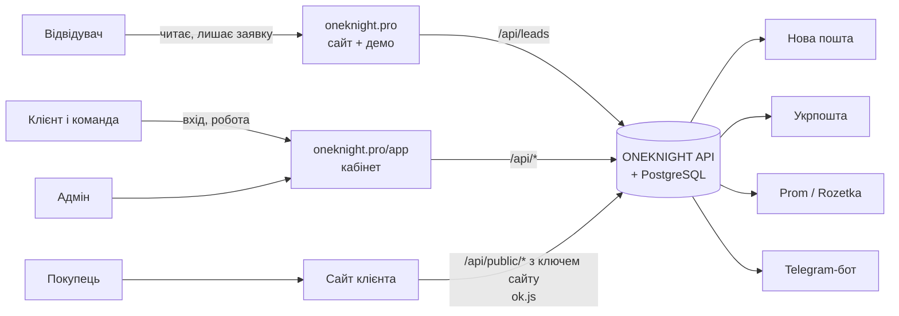
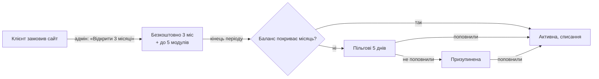

# ONEKNIGHT: архітектура проєкту

Карта проєкту: що є, для кого, де живе і як частини пов'язані. Технічні рішення по кроках (чому саме так) лежать у [docs/decisions.md](docs/decisions.md), API для сайтів клієнтів описано в [docs/public-api.md](docs/public-api.md), чого ще бракує від власника — у [TODO.md](TODO.md).

Стан на 29.09.2026: усе працює локально, домен `oneknight.pro` ще не підключений до сервера.

---

## 1. Три частини проєкту

| Частина | Адреса | Для кого | Навіщо |
| --- | --- | --- | --- |
| **Сайт ONEKNIGHT** | `oneknight.pro` (укр.), `oneknight.pro/en` | Відвідувачі, майбутні клієнти | Показати послуги, ціни, кейс, демо ONEKNIGHT і зібрати заявку |
| **Кабінет ONEKNIGHT** | `oneknight.pro/app` | Клієнти (власники бізнесу та їхня команда), адмін | Керувати сайтом, товарами, замовленнями, відгуками, аналітикою, доставкою, оплатою |
| **Сайти клієнтів** | домени клієнтів (наприклад `karpatu.shop`) | Покупці клієнтів | Продавати; товари, замовлення, відгуки, аналітика й вигляд беруться з ONEKNIGHT через публічний API |



---

## 2. Хто користується і що бачить

| Хто | Де працює | Що може |
| --- | --- | --- |
| **Відвідувач** | сайт | Читати, гратися з демо, залишити заявку (бриф) або написати в месенджер |
| **Власник бізнесу** (`owner`) | кабінет | Усе в своєму бізнесі: сайт, товари, замовлення, модулі, інтеграції, оплата, команда, резервні копії, назва бізнесу |
| **Менеджер** (`manager`) | кабінет | Те, що дав власник. За замовчуванням: замовлення, товари, відгуки, підтримка |
| **Маркетолог** (`marketer`) | кабінет | Те, що дав власник. За замовчуванням: аналітика, відгуки, сайт |
| **Покупець** | сайт клієнта | Купити, залишити відгук. Акаунта в ONEKNIGHT не має |
| **Адмін платформи** (Іван, `isAdmin`) | кабінет, розділ «Адміністрування» | Усі заявки, клієнти й сайти, відкриття пробного періоду, підтвердження поповнень, звернення в підтримку, ключі доступу й промокоди, посилання для зміни пароля |

Права задаються галочками в «Команді»: `orders`, `products`, `reviews`, `analytics`, `site`, `modules`, `billing`, `team`, `support`. Власник завжди має всі. Одна людина може бути в кількох бізнесах і перемикатися між ними вгорі кабінету. Сервер перевіряє права сам, інтерфейс лише ховає недоступне.

---

## 3. Сайт oneknight.pro

Одна довга сторінка, блоки по порядку:

| # | Блок | Для чого |
| --- | --- | --- |
| 1 | Hero (рідина WebGL) | Перше враження, кнопка «Замовити» |
| 2 | Хаос → система | Біль клієнта: розрізнені інструменти |
| 3 | Воронка | Як сайт перетворює відвідувачів на заявки |
| 4 | Послуги | 5 напрямів: сайти, автоматизація, аналітика, реклама, SEO/GEO/AI, з інтерактивом |
| 5 | Ціни | Типи сайтів від 7 000 / 12 000 / 14 000 / 15 000+ грн |
| 6 | Не шаблон | Порівняння шаблон vs система |
| 7 | Кейс Karpatu | Реальна робота |
| 8 | ONEKNIGHT: вступ | Що таке продукт |
| 9 | Демо ONEKNIGHT | Робоча демоверсія на вигаданих даних (позначено) |
| 10 | Модулі | Каталог модулів і ціни |
| 11 | Пропозиція | 3 місяці ONEKNIGHT безкоштовно й до 5 модулів із сайтом |
| 12 | Довіра | Чому можна довіряти (без вигаданих відгуків) |
| 13 | Процес | Етапи роботи |
| 14 | Підтримка | Що входить у підтримку |
| 15 | Про мене | Хто робить |
| 16 | Фінал | Останній заклик |

Також: юридичні сторінки `/legal/{privacy, terms, offer, cookies, oneknight-terms, subscription-terms, refund}`, сторінка 404, англійська версія `/en`.

**Куди веде заявка:** форма «Замовити» → `POST /api/leads` → заявка з номером у базі, сповіщення Івану в Telegram, видно в «Адміністрування → Заявки». Альтернатива: Telegram, Viber/WhatsApp, Facebook. Якщо людина вже увійшла, заявка прив'язується до її акаунта й бізнесу.

**Прокрутка:** звичайна, крім анімованих сцен (hero, хаос, «не шаблон», кейс, ONEKNIGHT, процес), де один жест доводить анімацію до наступного кадру.

---

## 4. Кабінет ONEKNIGHT (`/app`)

Вхід: пошта + пароль, за бажанням 2FA (Google Authenticator). Пошту не підтверджуємо. Розділ зберігається в адресі (`/app/#orders`), тож оновлення сторінки не скидає екран.

### 4.1. Розділи клієнта

| Розділ | Потрібне право | Що там |
| --- | --- | --- |
| Головна | — | Стан сайту, цифри за період, підказки («insights»), ваші заявки на послуги |
| Замовлення | `orders` | Замовлення з сайту, Prom, Rozetka; статуси; гарантія; **«Оформити ТТН» → друк** (Нова пошта, Укрпошта) |
| Товари | `products` | Каталог сайту: назва, ціна, залишок, фото |
| Відгуки | `reviews` | Модерація, публікація, креатив-картинка з відгуку (модуль «Відгуки») |
| Аналітика | `analytics` | Звідки приходять люди, UTM, продажі по джерелах (модуль «Аналітика») |
| Сайт | `site` (для змін) | Моніторинг сайту й SSL, ключ сайту для API, вигляд сайту (кнопки, звуки, колір) |
| Модулі | `modules` | **Лише купити й прочитати, що дає модуль** |
| Інтеграції | `modules` | **Лише ключі/доступи** до Нової пошти, Укрпошти, Prom, Rozetka |
| Оплата | `billing` | Підписка, баланс, поповнення переказом на IBAN, ключ доступу або промокод, історія |
| Послуги | — | Замовити нову роботу (сайт, SEO, реклама…) з кабінету |
| Підтримка | `support` | Звернення з фото, відповіді |
| Команда | `team` | Запрошення за посиланням, ролі, галочки прав |
| Безпека | — | 2FA, активні сеанси, історія входів |
| Профіль | — | Ім'я, телефон, назва бізнесу (власник), зміна пароля, Telegram-сповіщення, резервні копії (власник) |

Правило розміщення, яке ми тримаємо: **купівля — у «Модулях», доступи — в «Інтеграціях», робота — там, де вона відбувається** (ТТН у замовленні, відгуки у «Відгуках» тощо).

### 4.2. Розділи адміна («Адміністрування»)

| Розділ | Що там |
| --- | --- |
| Заявки (адмін) | Усі заявки з сайту й кабінету, статуси |
| Звернення (адмін) | Усі звернення в підтримку, відповіді |
| Клієнти й сайти | Бізнеси, їхні сайти (додати домен, перевірити), відкрити 3 місяці безкоштовно, **посилання для зміни пароля** |
| Поповнення (адмін) | Заявки на поповнення: «Гроші надійшли» → баланс |
| Ключі й промокоди | Партії ключів (ONEKNIGHT або модуль на N місяців), промокоди (знижка % або бонус) |

---

## 5. Сайт клієнта ↔ ONEKNIGHT

Кожен сайт у кабінеті має **ключ сайту** (`sk_…`, «Сайт → API»). Сайт клієнта звертається до ONEKNIGHT так:

| Що | Як |
| --- | --- |
| Каталог товарів | `GET /api/public/products` з заголовком `x-site-key` |
| Замовлення | `POST /api/public/orders` (ціни рахує сервер, залишки знімаються) |
| Відгуки | `GET/POST /api/public/reviews…` (якщо модуль увімкнено) |
| Аналітика | скрипт `ok.js` на сайті: візити, джерела, UTM, без cookies |
| Вигляд | той самий `ok.js` з `data-appearance`: анімації кнопок, звуки, сповіщення |

Запити дозволені лише з домену цього сайту (CORS). Деталі — [docs/public-api.md](docs/public-api.md).

---

## 6. Модулі та інтеграції

| Модуль | Купити | Доступи | Де працює | Стан |
| --- | --- | --- | --- | --- |
| Відгуки | Модулі | — | Відгуки + сайт клієнта | працює |
| Аналітика | Модулі | — | Аналітика + `ok.js` | працює |
| Нова пошта | Модулі | Інтеграції: API-ключ | Замовлення → «Оформити ТТН» → друк A4 / 100×100 | працює, реальний ключ підключено, реальну ТТН ще не створювали |
| Укрпошта | Модулі | Інтеграції: 2 ключі з договору + дані відправника | Замовлення → «Оформити ТТН» → друк наклейки | зроблено за документацією, потрібні ключі |
| Prom.ua | Модулі | Інтеграції: API-токен | Замовлення (імпорт кожні 10 хв) | потрібен токен для перевірки |
| Rozetka | Модулі | Інтеграції: логін/пароль продавця | Замовлення (імпорт кожні 10 хв) | потрібен акаунт для перевірки |
| OLX | — | — | — | у розробці: потрібен партнерський доступ OLX |
| AI Контент | — | — | — | скоро: потрібен ключ AI-сервісу |
| Zadarma | — | — | — | скоро |

Ціни: ONEKNIGHT 149 грн/міс, кожен модуль 99 грн/міс, підтримка 1 000 грн/міс.

---

## 7. Гроші



- **Баланс** поповнюється лише переказом на IBAN: клієнт отримує реквізити з кодом `OK-XXXXXXXX`, адмін підтверджує, коли гроші надійшли. Платіжних систем немає.
- **Списання** щомісяця: ONEKNIGHT + кожен модуль, мінус те, що покрито ключем, мінус знижка з промокоду.
- **Ключ доступу** оплачує ONEKNIGHT або модуль на N місяців. **Промокод** дає знижку % на кілька продовжень або бонус на баланс.
- Кожен рух коштів записаний у журнал (у копійках).

---

## 8. Сповіщення

| Подія | Дзвіночок у кабінеті | Telegram бізнесу | Telegram Івана |
| --- | --- | --- | --- |
| Нове замовлення / відгук | так | так (якщо є право) | — |
| Сайт упав / піднявся / SSL закінчується | так | так | так |
| Оплата: продовжено, бракує, призупинено, поповнено | так | так (право `billing`) | — |
| Відповідь підтримки / новий учасник команди | так | так | — |
| Нова заявка з сайту | — | — | так |

Telegram бізнесу: кожна людина сама підключає свій Telegram у «Профілі» (бот `@oneknight_bot`) і обирає, що отримувати.

---

## 9. Що працює у фоні

| Процес | Як часто |
| --- | --- |
| Перевірка сайтів клієнтів (HTTPS, SSL) | кожні 5 хв |
| Продовження підписок, пільгові дні, призупинення | щогодини |
| Автоматична резервна копія бізнесу | раз на добу (перевірка щогодини) |
| Імпорт замовлень Prom і Rozetka | кожні 10 хв |
| Розсилка сповіщень у Telegram | кожні 15 с |
| Прийом повідомлень бота (/start, /stop) | постійно |
| Прибирання: файли без власника, кошик відгуків (30 днів), стара аналітика, файли видалених копій | раз на добу |

---

## 10. Дані

Одна база PostgreSQL. Кожен запис бізнесу прив'язаний до `organization`, тож бізнеси не бачать дані один одного.

| Група | Таблиці |
| --- | --- |
| Люди й доступ | users, organizations, memberships, sessions, login_events, audit_log, invites, password_resets, telegram_links |
| Сайт і заявки | leads, sites, monitor_checks, notifications |
| Магазин | products, orders, order_events, reviews, files |
| Аналітика | analytics_events, insight_dismissals |
| Гроші | subscriptions, ledger_entries, module_installs, topups, access_keys, promo_codes, promo_redemptions |
| Інтеграції | integrations (ключі зашифровані) |
| Підтримка | tickets, ticket_messages |
| Копії | backups (самі файли на диску) |

Файли (фото товарів, скриншоти, резервні копії) лежать на диску сервера в `apps/api/var/uploads`.

---

## 11. Безпека коротко

- Паролі: Argon2id. Сесія: HttpOnly cookie, у базі лише хеш.
- 2FA: Google Authenticator, секрет зашифрований, один код не приймається двічі.
- Блокування після 5 невдалих входів на пошту (20 на IP) за 15 хвилин, ліміти запитів.
- Ключі інтеграцій, токени ботів і маркетплейсів: зашифровані, в браузер не повертаються; друк ТТН іде через наш сервер.
- Одноразові посилання (запрошення, зміна пароля, Telegram): у базі лише хеш.
- Важливі дії записуються в журнал аудиту.

---

## 12. Код: де що лежить

```
oneknight/
├─ apps/web/                 Сайт + кабінет (Next.js, статичні файли)
│  ├─ src/features/          Блоки сайту: hero, chaos, funnel, services, pricing, case, oneknight (демо), …
│  ├─ src/features/app/      Кабінет: Panel (меню), Shop, Waybill, Integrations, Billing, Team, …
│  ├─ src/i18n/{uk,en}/      Усі тексти (сайт, демо, кабінет)
│  ├─ public/ok.js           Скрипт для сайтів клієнтів (аналітика + вигляд)
│  └─ tests/*.mjs            Браузерні тести
├─ apps/api/                 Сервер ONEKNIGHT (Fastify)
│  ├─ src/<розділ>/          auth, shop, billing, integrations, notify, backups, …
│  ├─ src/db/schema.ts       Структура бази
│  ├─ drizzle/               Міграції бази
│  └─ src/**/*.test.ts       Тести сервера
├─ packages/domain/          Спільне: ціни, каталог модулів
├─ docs/                     decisions.md (технічний журнал), public-api.md
├─ ARCHITECTURE.md           Цей документ
├─ README.md                 Як запустити
└─ TODO.md                   Що потрібно від власника
```

---

## 13. Середовища

| | Зараз | Потрібно для запуску |
| --- | --- | --- |
| Сервер | локальний комп'ютер | VPS або хостинг для API + PostgreSQL + статичного сайту |
| Домен | не підключений | `oneknight.pro` → сервер, HTTPS |
| Налаштування | `.env` (не в git) | ті самі змінні на сервері + `COOKIE_SECURE=true`, `APP_ORIGINS=https://oneknight.pro` |
| Оплата | IBAN порожній | реквізити в `.env` |
| Код | приватний GitHub `reyxdev/oneknight` | — |

---

## 14. Відкриті питання

Потрібні рішення власника; від них залежить, як будувати далі.

1. **Де житимуть сайти клієнтів?** На нашому сервері (тоді можливі резервні копії файлів сайту, оновлення, «Сайт» як редактор) чи на хостингу клієнта (тоді лише моніторинг і API, як зараз)?
2. **Чи можна купити ONEKNIGHT без замовлення сайту?** Зараз підписка стартує лише через адміна («3 місяці безкоштовно») або ключ доступу. Кнопки «Оплатити 149 грн і почати» немає.
3. **Підтримка 1 000 грн/міс** є в цінах, але в кабінеті не купується: звернення зараз безкоштовні для всіх. Що саме дає платна підтримка і хто її купує?
4. **Адмін лише ти** чи будуть співробітники з обмеженим адмін-доступом (наприклад, лише підтримка)?
5. **Де розгортати**: конкретний хостинг або VPS для `oneknight.pro`?
