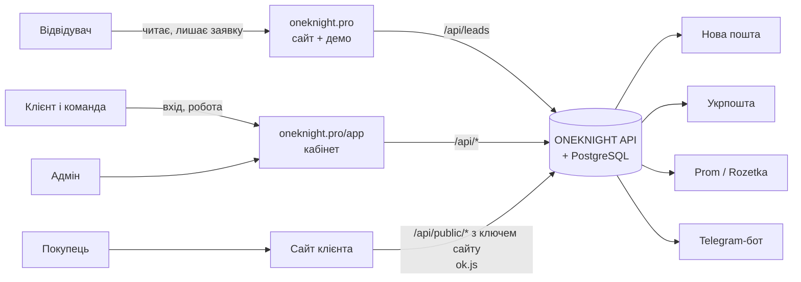
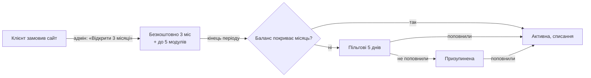

# ONEKNIGHT: архітектура проєкту

Карта проєкту: що є, для кого, де живе і як частини пов'язані. Технічні рішення по кроках (чому саме так) лежать у [docs/decisions.md](docs/decisions.md), API для сайтів клієнтів описано в [docs/public-api.md](docs/public-api.md), чого ще бракує від власника — у [TODO.md](TODO.md).

Стан на 29.09.2026: усе працює локально, домен `oneknight.pro` ще не підключений до сервера.

---

## 1. Три частини проєкту

| Частина | Адреса | Для кого | Навіщо |
| --- | --- | --- | --- |
| **Сайт ONEKNIGHT** | `oneknight.pro` (укр.), `oneknight.pro/en` | Відвідувачі, майбутні клієнти | Показати послуги, ціни, кейс, демо ONEKNIGHT і зібрати заявку |
| **Кабінет ONEKNIGHT** | `oneknight.pro/app` | Клієнти (власники бізнесу та їхня команда), адмін | Керувати сайтом, товарами, замовленнями, відгуками, аналітикою, доставкою, оплатою |
| **Сайти клієнтів** | домени клієнтів (наприклад `karpatu.shop`) | Покупці клієнтів | Продавати; товари, замовлення, відгуки, аналітика й вигляд беруться з ONEKNIGHT через публічний API |



---

## 2. Хто користується і що бачить

| Хто | Де працює | Що може |
| --- | --- | --- |
| **Відвідувач** | сайт | Читати, гратися з демо, залишити заявку (бриф) або написати в месенджер |
| **Власник бізнесу** (`owner`) | кабінет | Усе в своєму бізнесі: сайт, товари, замовлення, модулі, інтеграції, оплата, команда, резервні копії, назва бізнесу |
| **Менеджер** (`manager`) | кабінет | Те, що дав власник. За замовчуванням: замовлення, товари, відгуки, підтримка |
| **Маркетолог** (`marketer`) | кабінет | Те, що дав власник. За замовчуванням: аналітика, відгуки, сайт |
| **Покупець** | сайт клієнта | Купити, залишити відгук. Акаунта в ONEKNIGHT не має |
| **Адмін платформи** (Іван, `isAdmin`) | кабінет, режим «Адмінка» | Усі заявки, клієнти й сайти, відкриття пробного періоду, підтвердження поповнень, звернення в підтримку, ключі доступу й промокоди, посилання для зміни пароля |

Права задаються галочками в «Команді»: `orders`, `products`, `reviews`, `analytics`, `site`, `modules`, `billing`, `team`, `support`. Власник завжди має всі. Одна людина може бути в кількох бізнесах і перемикатися між ними вгорі кабінету. Сервер перевіряє права сам, інтерфейс лише ховає недоступне.

---

## 3. Сайт oneknight.pro

Одна довга сторінка, блоки по порядку:

| # | Блок | Для чого |
| --- | --- | --- |
| 1 | Hero (рідина WebGL) | Перше враження, кнопка «Замовити» |
| 2 | Хаос → система | Біль клієнта: розрізнені інструменти |
| 3 | Воронка | Як сайт перетворює відвідувачів на заявки |
| 4 | Послуги | 5 напрямів: сайти, автоматизація, аналітика, реклама, SEO/GEO/AI, з інтерактивом |
| 5 | Ціни | Типи сайтів від 7 000 / 12 000 / 14 000 / 15 000+ грн |
| 6 | Не шаблон | Порівняння шаблон vs система |
| 7 | Кейс Karpatu | Реальна робота |
| 8 | ONEKNIGHT: вступ | Що таке продукт |
| 9 | Демо ONEKNIGHT | Робоча демоверсія на вигаданих даних (позначено) |
| 10 | Модулі | Каталог модулів і ціни |
| 11 | Пропозиція | 3 місяці ONEKNIGHT безкоштовно й до 5 модулів із сайтом |
| 12 | Довіра | Чому можна довіряти (без вигаданих відгуків) |
| 13 | Процес | Етапи роботи |
| 14 | Підтримка | Що входить у підтримку |
| 15 | Про мене | Хто робить |
| 16 | Фінал | Останній заклик |

Також: юридичні сторінки `/legal/{privacy, terms, offer, cookies, oneknight-terms, subscription-terms, refund}`, сторінка 404, англійська версія `/en`.

**Куди веде заявка:** форма «Замовити» → `POST /api/leads` → заявка з номером у базі, сповіщення Івану в Telegram, видно в «Адміністрування → Заявки». Альтернатива: Telegram, Viber/WhatsApp, Facebook. Якщо людина вже увійшла, заявка прив'язується до її акаунта й бізнесу.

**Прокрутка:** звичайна, крім анімованих сцен (hero, хаос, «не шаблон», кейс, ONEKNIGHT, процес), де один жест доводить анімацію до наступного кадру.

---

## 4. Кабінет ONEKNIGHT (`/app`): логіка панелі

Вхід: пошта + пароль, за бажанням 2FA (Google Authenticator). Пошту не підтверджуємо. Розділ зберігається в адресі (`/app/#orders`), тож оновлення сторінки не скидає екран.

> Статус: розділ описує **цільову** панель (погоджено з власником 29.09.2026). Що вже зроблено, а що ні — у таблиці 4.8.

### 4.1. Каркас

- **Меню зліва, 4 групи** (на комп'ютері):

  | Група | Пункти |
  | --- | --- |
  | Робота | Головна · Замовлення · Покупці · Товари · Відгуки · Аналітика |
  | Сайт | Сайт |
  | Розвиток | Модулі · Послуги |
  | Налаштування | Інтеграції · Оплата · Команда · Профіль і безпека |

  Унизу меню: «Підтримка», «На сайт», «Вийти».
- **Верхня панель**: перемикач бізнесу (якщо їх кілька) · перемикач сайту («Усі сайти» або конкретний, видно лише коли сайтів більше одного) · дзвіночок · користувач. Вибраний сайт фільтрує Замовлення, Товари, Відгуки, Аналітику й цифри на Головній.
- **Телефон**: нижня панель із 5 кнопок: Головна · Замовлення · Покупці · Товари · «Ще» (решта меню тими ж групами).
- **Некуплений модуль** (Відгуки, Аналітика): пункт у меню видно із замком. Усередині — що дає модуль, ціна й кнопка «Підключити» (веде в Модулі). Людині без права `modules` натомість показуємо «Попросіть власника підключити».
- **Немає права**: пункту в меню немає; прямий перехід показує «Немає доступу». Сервер перевіряє права сам.
- **Правило розміщення**: купівля — у «Модулях», доступи — в «Інтеграціях», робота — там, де вона відбувається (ТТН у замовленні, відгуки у «Відгуках»).

### 4.2. Група «Робота»

**Головна** (усі)
1. Перемикач періоду: Сьогодні · 7 днів (за замовчуванням) · 30 · 90; вибір запам'ятовується. Кожна цифра порівнюється з попереднім таким самим періодом.
2. Цифри: замовлення, виручка, середній чек, візити (якщо є Аналітика) + графік по днях.
3. «Що треба зробити» — кожен пункт веде у відфільтрований список:
   - нові замовлення, що чекають підтвердження;
   - замовлення з доставкою Новою поштою чи Укрпоштою без ТТН;
   - відмова від посилки / посилка повертається;
   - відгуки на модерації;
   - сайт недоступний, SSL закінчується, сайт не підтверджено;
   - баланс: вистачить менш ніж на 7 днів, пільгові дні, призупинено;
   - відповідь підтримки без прочитання.
4. Підказки (insights), стан сайту коротко.
5. Для нового клієнта вгорі **«Перші кроки»** (зникає, коли все зроблено або закрите): додати сайт → вставити `ok.js` (сайт підтверджено) → додати товари → запустити підписку → увімкнути 2FA → підключити Telegram.

**Замовлення** (право `orders`)
- Один список з усіх джерел: сайт, Prom, Rozetka, вручну. Біля кожного — значок джерела.
- Фільтри: статус, джерело; пошук за номером, телефоном, ім'ям, ТТН.
- **«Нове замовлення»** вручну: покупець (пошук у базі або новий), товари з каталогу, доставка (спосіб, місто, відділення), оплата, джерело (дзвінок, Instagram, Viber, Telegram, Facebook, інше), коментар. Далі як звичайне.
- Картка замовлення: покупець (посилання в «Покупці»), товари, доставка, оплата, статус, **«Оформити ТТН» → друк** (Нова пошта, Укрпошта), стан доставки, гарантія, історія.
- **Статуси автоматично за доставкою**: ТТН створено → «Відправлено»; перевізник: отримано → «Завершено»; відмова/повернення → сповіщення й пункт у «Що треба зробити». Решту змінюють вручну.

**Покупці** (право `orders`)
- База формується сама із замовлень (один покупець = один телефон у межах бізнесу). Також створюється з ручного замовлення.
- Список: ім'я, телефон, кількість замовлень, сума, останнє замовлення, мітки. Фільтр за мітками, пошук.
- Картка: контакти, усі замовлення, відгуки, **нотатки** (стрічка з датою й автором), **мітки**.
- Мітки: готові (VIP, Опт, Проблемний; «Постійний» ставиться сам після 3 завершених замовлень) + свої з кольором.

**Товари** (право `products`): каталог вибраного сайту; назва, ціна, залишок, фото, увімкнено. Лише для сайту: Prom і Rozetka ведуться у своїх кабінетах.

**Відгуки** (право `reviews`, модуль): модерація, публікація, кошик, креатив-картинка.

**Аналітика** (право `analytics`, модуль): джерела, UTM, продажі за джерелами, той самий перемикач періоду.

### 4.3. Група «Сайт»

**Сайт** (перегляд усім, зміни — право `site`)
- Кілька сайтів: список + **«Додати сайт»** (клієнт сам):
  1. вводить домен;
  2. отримує код `ok.js` зі своїм ключем;
  3. статус «Очікує підтвердження», доки ONEKNIGHT не побачить скрипт на цьому домені, потім «Підтверджено».

  Так чужий домен не можна зайняти. Моніторинг і публічний API працюють лише для підтвердженого сайту.
- На кожен сайт: моніторинг (доступність, швидкість, SSL), ключ сайту та приклади API, «Вигляд сайту».

### 4.4. Група «Розвиток»

- **Модулі** (право `modules`): каталог, що дає кожен модуль, ціна, «Підключити» / «Вимкнути». Нічого не налаштовується.
- **Послуги** (усі): замовити роботу (сайт, автоматизація, аналітика, реклама, SEO/GEO/AI) + «Ваші заявки» зі статусом.

### 4.5. Група «Налаштування»

- **Інтеграції** (право `modules`): лише доступи — Нова пошта (ключ), Укрпошта (ключі з договору й дані відправника), Prom (токен), Rozetka (логін продавця).
- **Оплата** (право `billing`):
  - стан підписки;
  - **«Почати підписку»**, коли її немає: з балансу одразу 149 грн, підписка активна (3 безкоштовні місяці — лише разом із сайтом від нас);
  - баланс і поповнення на IBAN;
  - ключ доступу або промокод;
  - позначка **«Підтримка за договором до …»**, якщо адмін її поставив;
  - історія.
- **Команда** (право `team`): запрошення за посиланням, ролі, галочки прав.
- **Профіль і безпека** (усі) — вкладки:
  - Профіль: ім'я, телефон, назва бізнесу (власник), пароль;
  - Безпека: 2FA, сеанси, історія входів;
  - Сповіщення: таблиця «подія × кабінет / Telegram», звук, підключення Telegram;
  - Резервні копії (лише власник).

### 4.6. Підтримка й сповіщення

- **Підтримка** (право `support`), кнопка внизу меню: звернення з фото, відповіді.
- **Дзвіночок**: клік по сповіщенню веде до замовлення, відгуку, сайту чи оплати. Які події показувати в кабінеті, а які в Telegram, людина обирає сама у «Профіль → Сповіщення».

### 4.7. Режим адміна (лише власник платформи)

Угорі перемикач **«Мій бізнес / Адмінка»**. В адмінці своє меню:

| Розділ | Що там |
| --- | --- |
| Огляд | Цифри платформи: бізнеси, активні підписки, щомісячний дохід, нові заявки, відкриті звернення, поповнення, що чекають |
| Заявки | Усі заявки з сайту й кабінету, статуси |
| Клієнти | Бізнеси, їхні сайти, підписка, «Відкрити 3 місяці безкоштовно», **«Підтримка за договором» (дата до)**, посилання для зміни пароля |
| Звернення | Усі звернення в підтримку, відповіді |
| Поповнення | «Гроші надійшли» → баланс |
| Ключі й промокоди | Партії ключів, промокоди |

### 4.8. Що вже є і що треба зробити

| Частина | Стан |
| --- | --- |
| Екрани замовлень, товарів, відгуків, аналітики, сайту, модулів, інтеграцій, оплати, команди, профілю, безпеки, послуг, підтримки | є, треба перенести в нову структуру |
| Меню групами, перемикач сайту, нижня панель на телефоні, замки модулів | треба зробити |
| Головна: період, графік, «Що треба зробити», «Перші кроки» | частково (цифри й підказки є) |
| Покупці з нотатками й мітками | треба зробити |
| Ручне замовлення, пошук, фільтр за джерелом | треба зробити |
| Статуси за доставкою (відстеження НП / Укрпошти) | треба зробити |
| Клієнт сам додає сайт + підтвердження через `ok.js` | треба зробити |
| «Почати підписку», «Підтримка за договором» | треба зробити |
| Профіль і безпека вкладками, налаштування сповіщень, переходи з дзвіночка | треба зробити |
| Режим адміна з «Оглядом» | треба зробити |

---

## 5. Сайт клієнта ↔ ONEKNIGHT

Кожен сайт у кабінеті має **ключ сайту** (`sk_…`, «Сайт → API»). Сайт клієнта звертається до ONEKNIGHT так:

| Що | Як |
| --- | --- |
| Каталог товарів | `GET /api/public/products` з заголовком `x-site-key` |
| Замовлення | `POST /api/public/orders` (ціни рахує сервер, залишки знімаються) |
| Відгуки | `GET/POST /api/public/reviews…` (якщо модуль увімкнено) |
| Аналітика | скрипт `ok.js` на сайті: візити, джерела, UTM, без cookies |
| Вигляд | той самий `ok.js` з `data-appearance`: анімації кнопок, звуки, сповіщення |

Запити дозволені лише з домену цього сайту (CORS). Деталі — [docs/public-api.md](docs/public-api.md).

---

## 6. Модулі та інтеграції

| Модуль | Купити | Доступи | Де працює | Стан |
| --- | --- | --- | --- | --- |
| Відгуки | Модулі | — | Відгуки + сайт клієнта | працює |
| Аналітика | Модулі | — | Аналітика + `ok.js` | працює |
| Нова пошта | Модулі | Інтеграції: API-ключ | Замовлення → «Оформити ТТН» → друк A4 / 100×100 | працює, реальний ключ підключено, реальну ТТН ще не створювали |
| Укрпошта | Модулі | Інтеграції: 2 ключі з договору + дані відправника | Замовлення → «Оформити ТТН» → друк наклейки | зроблено за документацією, потрібні ключі |
| Prom.ua | Модулі | Інтеграції: API-токен | Замовлення (імпорт кожні 10 хв) | потрібен токен для перевірки |
| Rozetka | Модулі | Інтеграції: логін/пароль продавця | Замовлення (імпорт кожні 10 хв) | потрібен акаунт для перевірки |
| OLX | — | — | — | у розробці: потрібен партнерський доступ OLX |
| AI Контент | — | — | — | скоро: потрібен ключ AI-сервісу |
| Zadarma | — | — | — | скоро |

Ціни: ONEKNIGHT 149 грн/міс, кожен модуль 99 грн/міс, підтримка 1 000 грн/міс.

---

## 7. Гроші



- **Баланс** поповнюється лише переказом на IBAN: клієнт отримує реквізити з кодом `OK-XXXXXXXX`, адмін підтверджує, коли гроші надійшли. Платіжних систем немає.
- **Списання** щомісяця: ONEKNIGHT + кожен модуль, мінус те, що покрито ключем, мінус знижка з промокоду.
- **Ключ доступу** оплачує ONEKNIGHT або модуль на N місяців. **Промокод** дає знижку % на кілька продовжень або бонус на баланс.
- Кожен рух коштів записаний у журнал (у копійках).

---

## 8. Сповіщення

| Подія | Дзвіночок у кабінеті | Telegram бізнесу | Telegram Івана |
| --- | --- | --- | --- |
| Нове замовлення / відгук | так | так (якщо є право) | — |
| Сайт упав / піднявся / SSL закінчується | так | так | так |
| Оплата: продовжено, бракує, призупинено, поповнено | так | так (право `billing`) | — |
| Відповідь підтримки / новий учасник команди | так | так | — |
| Нова заявка з сайту | — | — | так |

Telegram бізнесу: кожна людина сама підключає свій Telegram у «Профілі» (бот `@oneknight_bot`) і обирає, що отримувати.

---

## 9. Що працює у фоні

| Процес | Як часто |
| --- | --- |
| Перевірка сайтів клієнтів (HTTPS, SSL) | кожні 5 хв |
| Продовження підписок, пільгові дні, призупинення | щогодини |
| Автоматична резервна копія бізнесу | раз на добу (перевірка щогодини) |
| Імпорт замовлень Prom і Rozetka | кожні 10 хв |
| Розсилка сповіщень у Telegram | кожні 15 с |
| Прийом повідомлень бота (/start, /stop) | постійно |
| Прибирання: файли без власника, кошик відгуків (30 днів), стара аналітика, файли видалених копій | раз на добу |

---

## 10. Дані

Одна база PostgreSQL. Кожен запис бізнесу прив'язаний до `organization`, тож бізнеси не бачать дані один одного.

| Група | Таблиці |
| --- | --- |
| Люди й доступ | users, organizations, memberships, sessions, login_events, audit_log, invites, password_resets, telegram_links |
| Сайт і заявки | leads, sites, monitor_checks, notifications |
| Магазин | products, orders, order_events, reviews, files |
| Аналітика | analytics_events, insight_dismissals |
| Гроші | subscriptions, ledger_entries, module_installs, topups, access_keys, promo_codes, promo_redemptions |
| Інтеграції | integrations (ключі зашифровані) |
| Підтримка | tickets, ticket_messages |
| Копії | backups (самі файли на диску) |

Файли (фото товарів, скриншоти, резервні копії) лежать на диску сервера в `apps/api/var/uploads`.

---

## 11. Безпека коротко

- Паролі: Argon2id. Сесія: HttpOnly cookie, у базі лише хеш.
- 2FA: Google Authenticator, секрет зашифрований, один код не приймається двічі.
- Блокування після 5 невдалих входів на пошту (20 на IP) за 15 хвилин, ліміти запитів.
- Ключі інтеграцій, токени ботів і маркетплейсів: зашифровані, в браузер не повертаються; друк ТТН іде через наш сервер.
- Одноразові посилання (запрошення, зміна пароля, Telegram): у базі лише хеш.
- Важливі дії записуються в журнал аудиту.

---

## 12. Код: де що лежить

```
oneknight/
├─ apps/web/                 Сайт + кабінет (Next.js, статичні файли)
│  ├─ src/features/          Блоки сайту: hero, chaos, funnel, services, pricing, case, oneknight (демо), …
│  ├─ src/features/app/      Кабінет: Panel (меню), Shop, Waybill, Integrations, Billing, Team, …
│  ├─ src/i18n/{uk,en}/      Усі тексти (сайт, демо, кабінет)
│  ├─ public/ok.js           Скрипт для сайтів клієнтів (аналітика + вигляд)
│  └─ tests/*.mjs            Браузерні тести
├─ apps/api/                 Сервер ONEKNIGHT (Fastify)
│  ├─ src/<розділ>/          auth, shop, billing, integrations, notify, backups, …
│  ├─ src/db/schema.ts       Структура бази
│  ├─ drizzle/               Міграції бази
│  └─ src/**/*.test.ts       Тести сервера
├─ packages/domain/          Спільне: ціни, каталог модулів
├─ docs/                     decisions.md (технічний журнал), public-api.md
├─ ARCHITECTURE.md           Цей документ
├─ README.md                 Як запустити
└─ TODO.md                   Що потрібно від власника
```

---

## 13. Середовища

| | Зараз | Потрібно для запуску |
| --- | --- | --- |
| Сервер | локальний комп'ютер | VPS або хостинг для API + PostgreSQL + статичного сайту |
| Домен | не підключений | `oneknight.pro` → сервер, HTTPS |
| Налаштування | `.env` (не в git) | ті самі змінні на сервері + `COOKIE_SECURE=true`, `APP_ORIGINS=https://oneknight.pro` |
| Оплата | IBAN порожній | реквізити в `.env` |
| Код | приватний GitHub `reyxdev/oneknight` | — |

---

## 14. Рішення власника (29.09.2026)

| Питання | Рішення | Що з цього випливає |
| --- | --- | --- |
| Де живуть сайти клієнтів | **На хостингу клієнта** | ONEKNIGHT не хостить сайти: лише моніторинг, публічний API, `ok.js`. Резервні копії — даних ONEKNIGHT, не файлів сайту |
| ONEKNIGHT без замовлення сайту | **Так, кнопкою в «Оплаті»** | Потрібна кнопка «Почати підписку»: поповнений баланс → одразу 149 грн і активна підписка, без безкоштовних 3 місяців (вони лише із сайтом) |
| Підтримка 1 000 грн/міс | **Окремий договір** | Поза кабінетом; у кабінеті лише показуємо, що підтримка діє (позначає адмін). Звернення в «Підтримці» доступні всім |
| Адміни платформи | **Лише власник** | Один повний адмін (`isAdmin`), окремих адмін-ролей не робимо |
| Панель | Меню групами; Головна: цифри й графік, потім «Що треба зробити»; замки на некуплених модулях; «Покупці» з нотатками й мітками | Розділ 4 |
| Сайти й замовлення | Перемикач сайту вгорі; статуси за доставкою; ручні замовлення; один список із фільтром за джерелом; товари лише для сайту | Розділ 4.2 |
| Телефон, старт, адмінка | Нижня панель; «Перші кроки» на Головній; адмінка окремим режимом | Розділи 4.1, 4.2, 4.7 |
| Сайти клієнтів | Клієнт додає сам, підтвердження через `ok.js`; мітки готові + свої; період 7 днів; сповіщення: дзвіночок + налаштування | Розділи 4.2, 4.3, 4.6 |

## 15. Відкриті питання

1. **Де розгортати**: конкретний хостинг або VPS для `oneknight.pro`.
